# 📡 Flujos de Llamadas a API - Ciudadano Digital Web

Documento que detalla el flujo de todas las llamadas a la API del backend para las operaciones principales de una aplicación web, extrapolado del uso en la aplicación Android.

---

## 🌐 Configuración Base

### URL Base
```
https://api.ciudadanodigital.com/api/
```

### Headers Estándar
```
Content-Type: application/json
Accept: application/json
Accept-Language: es-ES,es;q=0.9
```

### Header de Autenticación (peticiones autenticadas)
```
Authorization: Bearer <JWT_TOKEN>
```

---

## 🔐 1. Flujo de Autenticación (Login)

### Descripción General
El usuario inicia sesión con sus credenciales (email y contraseña). La aplicación web obtiene un token de acceso y un refresh token que se guardan en localStorage.

### Diagrama de Secuencia

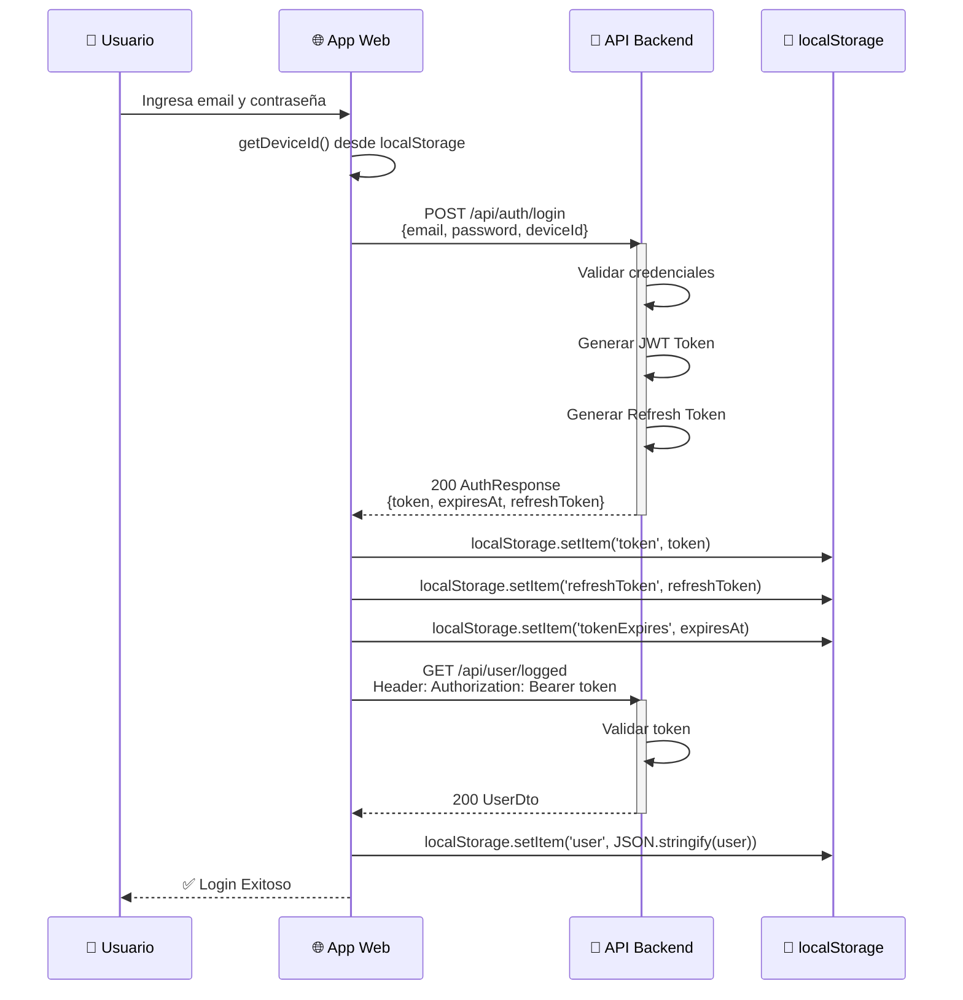
```mermaid
sequenceDiagram
    participant User as 👤 Usuario
    participant Web as 🌐 App Web
    participant API as 🔗 API Backend
    participant Storage as 💾 localStorage

    User->>Web: Ingresa email y contraseña
    Web->>Web: getDeviceId() desde localStorage
    Web->>API: POST /api/auth/login<br/>{email, password, deviceId}
    activate API
    API->>API: Validar credenciales
    API->>API: Generar JWT Token
    API->>API: Generar Refresh Token
    API-->>Web: 200 AuthResponse<br/>{token, expiresAt, refreshToken}
    deactivate API

    Web->>Storage: localStorage.setItem('token', token)
    Web->>Storage: localStorage.setItem('refreshToken', refreshToken)
    Web->>Storage: localStorage.setItem('tokenExpires', expiresAt)

    Web->>API: GET /api/user/logged<br/>Header: Authorization: Bearer token
    activate API
    API->>API: Validar token
    API-->>Web: 200 UserDto
    deactivate API

    Web->>Storage: localStorage.setItem('user', JSON.stringify(user))

    Web-->>User: ✅ Login Exitoso
```

### Tabla de Detalles de Endpoints

| Endpoint | Método | Descripción |
|----------|--------|-------------|
| `POST /api/auth/login` | POST | Login con email y contraseña |
| `GET /api/user/logged` | GET | Obtiene datos del usuario autenticado |

### Parámetros de Entrada
```json
{
    "email": "string",
    "password": "string",
    "deviceId": "string (UUID generado en navegador)"
}
```

### Respuestas
```json
// AuthResponse
{
    "token": "string (JWT)",
    "expiresAt": "number (Unix timestamp en segundos)",
    "refreshToken": "string",
    "refreshExpiresAt": "number"
}

// UserDto
{
    "userid": "number",
    "email": "string",
    "names": "string",
    "lastnames": "string",
    "phonecode": "string",
    "phonenumber": "string",
    "birthdate": "string (ISO 8601)",
    "role": "string"
}
```

### Manejo de Errores
- **401 Unauthorized**: Usuario o contraseña incorrectos
- **400 Bad Request**: Parámetros inválidos
- **500 Server Error**: Error interno del servidor

---

## 👤 2. Flujo de Creación de Usuario (Registro)

### Descripción General
Un nuevo usuario se registra proporcionando sus datos personales. La aplicación web primero crea la cuenta y luego obtiene los datos del usuario automáticamente.

### Diagrama de Secuencia

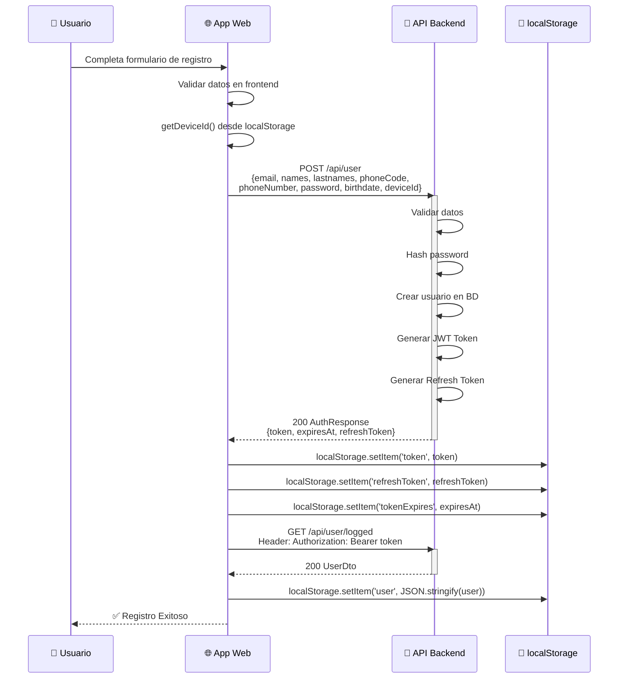
```mermaid
sequenceDiagram
    participant User as 👤 Usuario
    participant Web as 🌐 App Web
    participant API as 🔗 API Backend
    participant Storage as 💾 localStorage

    User->>Web: Completa formulario de registro
    Web->>Web: Validar datos en frontend
    Web->>Web: getDeviceId() desde localStorage
    Web->>API: POST /api/user<br/>{email, names, lastnames, phoneCode,<br/>phoneNumber, password, birthdate, deviceId}
    activate API
    API->>API: Validar datos
    API->>API: Hash password
    API->>API: Crear usuario en BD
    API->>API: Generar JWT Token
    API->>API: Generar Refresh Token
    API-->>Web: 200 AuthResponse<br/>{token, expiresAt, refreshToken}
    deactivate API

    Web->>Storage: localStorage.setItem('token', token)
    Web->>Storage: localStorage.setItem('refreshToken', refreshToken)
    Web->>Storage: localStorage.setItem('tokenExpires', expiresAt)

    Web->>API: GET /api/user/logged<br/>Header: Authorization: Bearer token
    activate API
    API-->>Web: 200 UserDto
    deactivate API

    Web->>Storage: localStorage.setItem('user', JSON.stringify(user))

    Web-->>User: ✅ Registro Exitoso
```

### Tabla de Detalles de Endpoints

| Endpoint | Método | Descripción |
|----------|--------|-------------|
| `POST /api/user` | POST | Registra un nuevo usuario |
| `GET /api/user/logged` | GET | Obtiene datos del usuario autenticado |

### Parámetros de Entrada
```json
{
    "email": "string",
    "names": "string",
    "lastnames": "string",
    "phoneCode": "string (ej: +502)",
    "phoneNumber": "string",
    "password": "string",
    "birthdate": "string (ISO 8601: YYYY-MM-DD)",
    "deviceId": "string"
}
```

### Respuestas
```json
// AuthResponse
{
    "token": "string (JWT)",
    "expiresAt": "number",
    "refreshToken": "string",
    "refreshExpiresAt": "number"
}
```

### Manejo de Errores
- **409 Conflict**: Email ya registrado
- **400 Bad Request**: Datos inválidos
- **422 Unprocessable Entity**: Validación fallida
- **500 Server Error**: Error interno del servidor

---

## 🔄 3. Flujo de Refresco de Token (Token Refresh)

### Descripción General
Antes de cada llamada a un endpoint autenticado, la aplicación web debe verificar si el token está por expirar y refrescarlo automáticamente.

### Diagrama de Secuencia

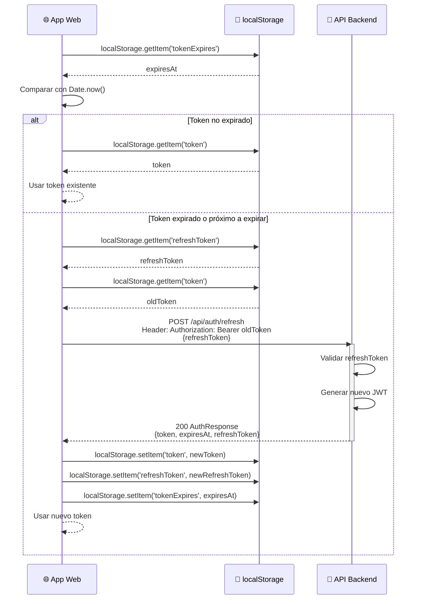
```mermaid
sequenceDiagram
    participant Web as 🌐 App Web
    participant Storage as 💾 localStorage
    participant API as 🔗 API Backend

    Web->>Storage: localStorage.getItem('tokenExpires')
    Storage-->>Web: expiresAt
    Web->>Web: Comparar con Date.now()

    alt Token no expirado
        Web->>Storage: localStorage.getItem('token')
        Storage-->>Web: token
        Web-->>Web: Usar token existente
    else Token expirado o próximo a expirar
        Web->>Storage: localStorage.getItem('refreshToken')
        Storage-->>Web: refreshToken
        Web->>Storage: localStorage.getItem('token')
        Storage-->>Web: oldToken

        Web->>API: POST /api/auth/refresh<br/>Header: Authorization: Bearer oldToken<br/>{refreshToken}
        activate API
        API->>API: Validar refreshToken
        API->>API: Generar nuevo JWT
        API-->>Web: 200 AuthResponse<br/>{token, expiresAt, refreshToken}
        deactivate API

        Web->>Storage: localStorage.setItem('token', newToken)
        Web->>Storage: localStorage.setItem('refreshToken', newRefreshToken)
        Web->>Storage: localStorage.setItem('tokenExpires', expiresAt)
        Web-->>Web: Usar nuevo token
    end
```

### Tabla de Detalles de Endpoints

| Endpoint | Método | Descripción |
|----------|--------|-------------|
| `POST /api/auth/refresh` | POST | Refresca el JWT token |

### Parámetros de Entrada
```json
{
    "refreshToken": "string"
}
```

### Respuestas
```json
{
    "token": "string (nuevo JWT)",
    "expiresAt": "number",
    "refreshToken": "string (nuevo refresh token)",
    "refreshExpiresAt": "number"
}
```

### Manejo de Errores
- **401 Unauthorized**: Refresh token inválido → Cerrar sesión
- **403 Forbidden**: Token expirado → Cerrar sesión

---

## 🚪 4. Flujo de Cierre de Sesión (Logout)

### Descripción General
El usuario cierra su sesión. Se notifica al servidor y se limpian los datos locales.

### Diagrama de Secuencia

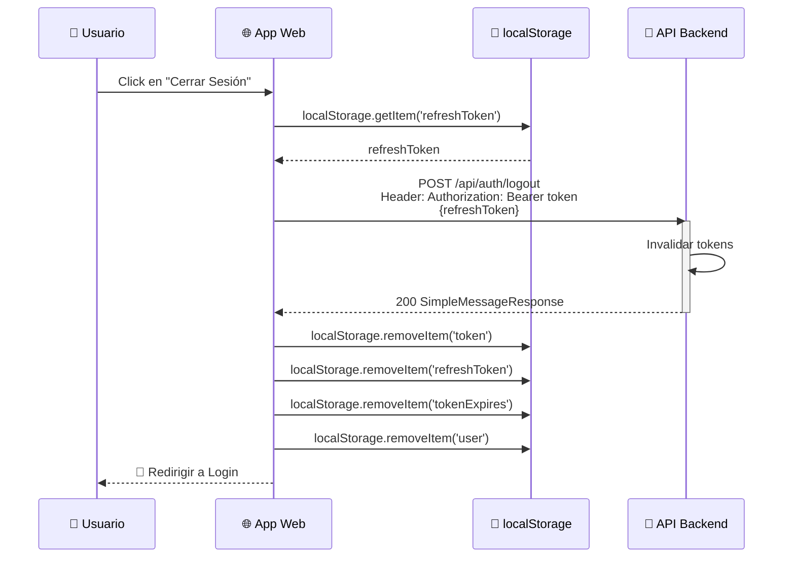
```mermaid
sequenceDiagram
    participant User as 👤 Usuario
    participant Web as 🌐 App Web
    participant Storage as 💾 localStorage
    participant API as 🔗 API Backend

    User->>Web: Click en "Cerrar Sesión"
    Web->>Storage: localStorage.getItem('refreshToken')
    Storage-->>Web: refreshToken

    Web->>API: POST /api/auth/logout<br/>Header: Authorization: Bearer token<br/>{refreshToken}
    activate API
    API->>API: Invalidar tokens
    API-->>Web: 200 SimpleMessageResponse
    deactivate API

    Web->>Storage: localStorage.removeItem('token')
    Web->>Storage: localStorage.removeItem('refreshToken')
    Web->>Storage: localStorage.removeItem('tokenExpires')
    Web->>Storage: localStorage.removeItem('user')

    Web-->>User: 🔄 Redirigir a Login
```

### Tabla de Detalles de Endpoints

| Endpoint | Método | Descripción |
|----------|--------|-------------|
| `POST /api/auth/logout` | POST | Cierra la sesión del usuario |

### Parámetros de Entrada
```json
{
    "refreshToken": "string"
}
```

### Respuestas
```json
{
    "message": "string"
}
```

---

## 🔐 5. Flujo de Recuperación de Contraseña

### Descripción General
Usuario olvida su contraseña. Se envía un código de verificación por email, se valida, y se establece una nueva contraseña.

### Diagrama de Secuencia

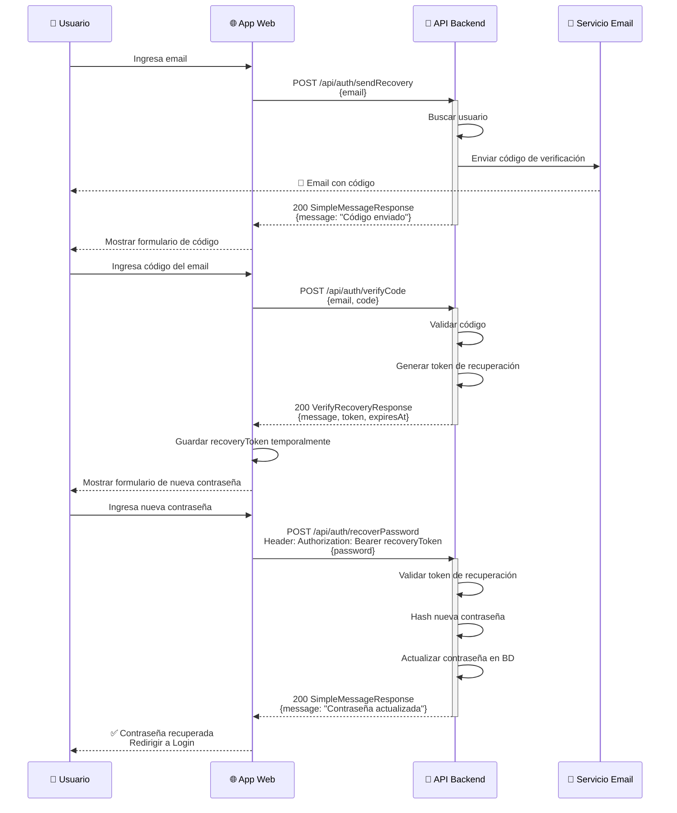
```mermaid
sequenceDiagram
    participant User as 👤 Usuario
    participant Web as 🌐 App Web
    participant API as 🔗 API Backend
    participant Email as 📧 Servicio Email

    User->>Web: Ingresa email
    Web->>API: POST /api/auth/sendRecovery<br/>{email}
    activate API
    API->>API: Buscar usuario
    API->>Email: Enviar código de verificación
    Email-->>User: 📧 Email con código
    API-->>Web: 200 SimpleMessageResponse<br/>{message: "Código enviado"}
    deactivate API

    Web-->>User: Mostrar formulario de código

    User->>Web: Ingresa código del email
    Web->>API: POST /api/auth/verifyCode<br/>{email, code}
    activate API
    API->>API: Validar código
    API->>API: Generar token de recuperación
    API-->>Web: 200 VerifyRecoveryResponse<br/>{message, token, expiresAt}
    deactivate API

    Web->>Web: Guardar recoveryToken temporalmente
    Web-->>User: Mostrar formulario de nueva contraseña

    User->>Web: Ingresa nueva contraseña
    Web->>API: POST /api/auth/recoverPassword<br/>Header: Authorization: Bearer recoveryToken<br/>{password}
    activate API
    API->>API: Validar token de recuperación
    API->>API: Hash nueva contraseña
    API->>API: Actualizar contraseña en BD
    API-->>Web: 200 SimpleMessageResponse<br/>{message: "Contraseña actualizada"}
    deactivate API

    Web-->>User: ✅ Contraseña recuperada<br/>Redirigir a Login
```

### Tabla de Detalles de Endpoints

| Endpoint | Método | Descripción |
|----------|--------|-------------|
| `POST /api/auth/sendRecovery` | POST | Envía código de verificación al email |
| `POST /api/auth/verifyCode` | POST | Valida código y obtiene token de recuperación |
| `POST /api/auth/recoverPassword` | POST | Establece nueva contraseña |

### Parámetros de Entrada
```json
// Send Recovery
{
    "email": "string"
}

// Verify Code
{
    "email": "string",
    "code": "number"
}

// Recover Password
{
    "password": "string"
}
```

### Respuestas
```json
// VerifyRecoveryResponse
{
    "message": "string",
    "token": "string (token temporal de recuperación)",
    "expiresAt": "number"
}

// SimpleMessageResponse
{
    "message": "string"
}
```

---

## 👤 6. Flujo de Actualización de Perfil

### Descripción General
El usuario actualiza su información personal desde su perfil.

### Diagrama de Secuencia

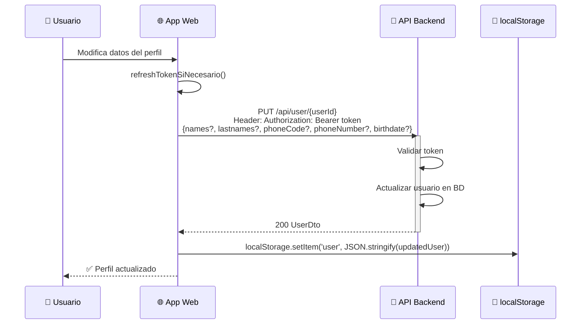
```mermaid
sequenceDiagram
    participant User as 👤 Usuario
    participant Web as 🌐 App Web
    participant API as 🔗 API Backend
    participant Storage as 💾 localStorage

    User->>Web: Modifica datos del perfil
    Web->>Web: refreshTokenSiNecesario()

    Web->>API: PUT /api/user/{userId}<br/>Header: Authorization: Bearer token<br/>{names?, lastnames?, phoneCode?, phoneNumber?, birthdate?}
    activate API
    API->>API: Validar token
    API->>API: Actualizar usuario en BD
    API-->>Web: 200 UserDto
    deactivate API

    Web->>Storage: localStorage.setItem('user', JSON.stringify(updatedUser))

    Web-->>User: ✅ Perfil actualizado
```

### Tabla de Detalles de Endpoints

| Endpoint | Método | Descripción |
|----------|--------|-------------|
| `PUT /api/user/{userId}` | PUT | Actualiza datos del usuario |

### Parámetros de Entrada
```json
{
    "names": "string (opcional)",
    "lastnames": "string (opcional)",
    "phoneCode": "string (opcional)",
    "phoneNumber": "string (opcional)",
    "birthdate": "string (opcional, ISO 8601)"
}
```

> **Nota:** Solo enviar los campos que se desean actualizar.

### Respuestas
```json
{
    "userid": "number",
    "email": "string",
    "names": "string",
    "lastnames": "string",
    "phonecode": "string",
    "phonenumber": "string",
    "birthdate": "string",
    "role": "string"
}
```

---

## 💬 7. Flujo de Obtención de Chats

### Descripción General
El usuario visualiza la lista de todos sus chats anteriores.

### Diagrama de Secuencia

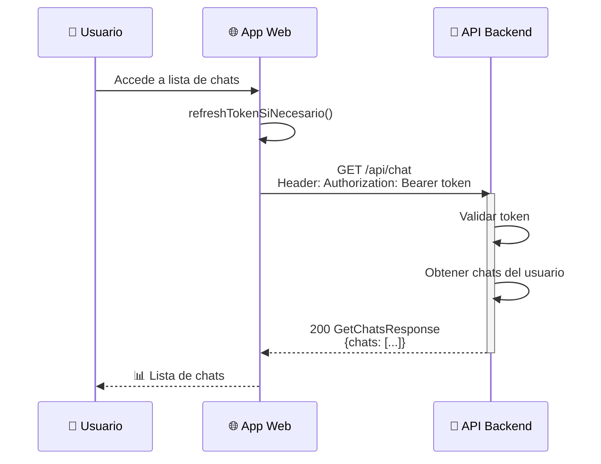
```mermaid
sequenceDiagram
    participant User as 👤 Usuario
    participant Web as 🌐 App Web
    participant API as 🔗 API Backend

    User->>Web: Accede a lista de chats
    Web->>Web: refreshTokenSiNecesario()

    Web->>API: GET /api/chat<br/>Header: Authorization: Bearer token
    activate API
    API->>API: Validar token
    API->>API: Obtener chats del usuario
    API-->>Web: 200 GetChatsResponse<br/>{chats: [...]}
    deactivate API

    Web-->>User: 📊 Lista de chats
```

### Tabla de Detalles de Endpoints

| Endpoint | Método | Descripción |
|----------|--------|-------------|
| `GET /api/chat` | GET | Obtiene todos los chats del usuario |

### Respuestas
```json
{
    "chats": [
        {
            "chatid": "number",
            "userid": "number",
            "fechainicio": "string (ISO 8601)",
            "nombre": "string"
        }
    ]
}
```

---

## 💬 8. Flujo de Mensajes en Chats

### 8.1 Obtener Mensajes de un Chat

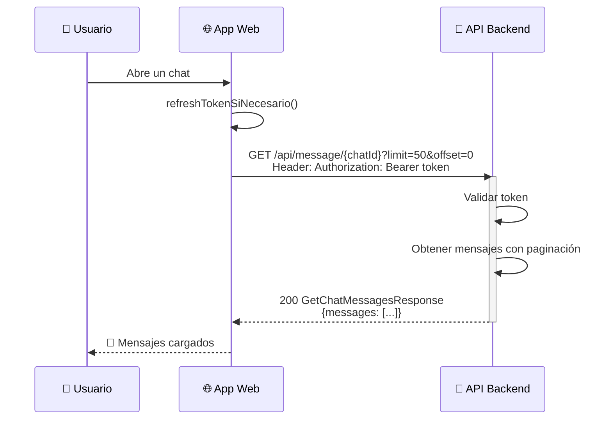
```mermaid
sequenceDiagram
    participant User as 👤 Usuario
    participant Web as 🌐 App Web
    participant API as 🔗 API Backend

    User->>Web: Abre un chat
    Web->>Web: refreshTokenSiNecesario()

    Web->>API: GET /api/message/{chatId}?limit=50&offset=0<br/>Header: Authorization: Bearer token
    activate API
    API->>API: Validar token
    API->>API: Obtener mensajes con paginación
    API-->>Web: 200 GetChatMessagesResponse<br/>{messages: [...]}
    deactivate API

    Web-->>User: 💬 Mensajes cargados
```

### 8.2 Enviar Mensaje y Obtener Respuesta de IA

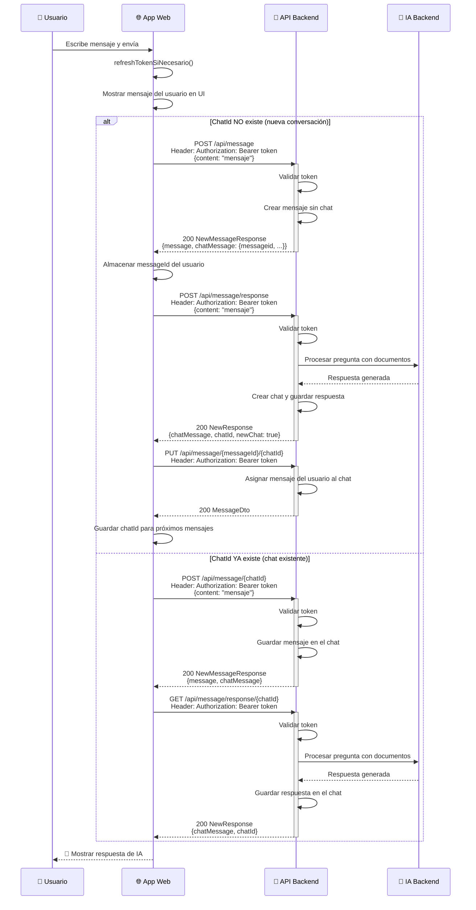
```mermaid
sequenceDiagram
    participant User as 👤 Usuario
    participant Web as 🌐 App Web
    participant API as 🔗 API Backend
    participant AI as 🤖 IA Backend

    User->>Web: Escribe mensaje y envía
    Web->>Web: refreshTokenSiNecesario()
    Web->>Web: Mostrar mensaje del usuario en UI

    alt ChatId NO existe (nueva conversación)
        Web->>API: POST /api/message<br/>Header: Authorization: Bearer token<br/>{content: "mensaje"}
        activate API
        API->>API: Validar token
        API->>API: Crear mensaje sin chat
        API-->>Web: 200 NewMessageResponse<br/>{message, chatMessage: {messageid, ...}}
        deactivate API
        Web->>Web: Almacenar messageId del usuario

        Web->>API: POST /api/message/response<br/>Header: Authorization: Bearer token<br/>{content: "mensaje"}
        activate API
        API->>API: Validar token
        API->>AI: Procesar pregunta con documentos
        AI-->>API: Respuesta generada
        API->>API: Crear chat y guardar respuesta
        API-->>Web: 200 NewResponse<br/>{chatMessage, chatId, newChat: true}
        deactivate API

        Web->>API: PUT /api/message/{messageId}/{chatId}<br/>Header: Authorization: Bearer token
        activate API
        API->>API: Asignar mensaje del usuario al chat
        API-->>Web: 200 MessageDto
        deactivate API

        Web->>Web: Guardar chatId para próximos mensajes

    else ChatId YA existe (chat existente)
        Web->>API: POST /api/message/{chatId}<br/>Header: Authorization: Bearer token<br/>{content: "mensaje"}
        activate API
        API->>API: Validar token
        API->>API: Guardar mensaje en el chat
        API-->>Web: 200 NewMessageResponse<br/>{message, chatMessage}
        deactivate API

        Web->>API: GET /api/message/response/{chatId}<br/>Header: Authorization: Bearer token
        activate API
        API->>API: Validar token
        API->>AI: Procesar pregunta con documentos
        AI-->>API: Respuesta generada
        API->>API: Guardar respuesta en el chat
        API-->>Web: 200 NewResponse<br/>{chatMessage, chatId}
        deactivate API
    end

    Web-->>User: 🤖 Mostrar respuesta de IA
```

### 8.3 Crear Mensaje sin Respuesta de IA (opcional)

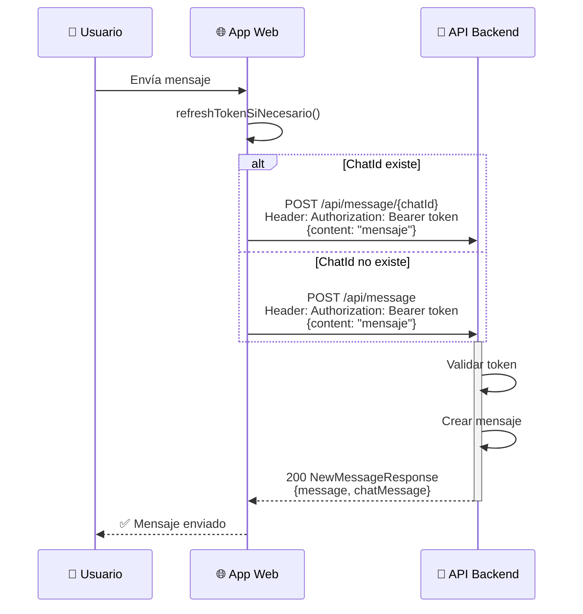
```mermaid
sequenceDiagram
    participant User as 👤 Usuario
    participant Web as 🌐 App Web
    participant API as 🔗 API Backend

    User->>Web: Envía mensaje
    Web->>Web: refreshTokenSiNecesario()

    alt ChatId existe
        Web->>API: POST /api/message/{chatId}<br/>Header: Authorization: Bearer token<br/>{content: "mensaje"}
    else ChatId no existe
        Web->>API: POST /api/message<br/>Header: Authorization: Bearer token<br/>{content: "mensaje"}
    end

    activate API
    API->>API: Validar token
    API->>API: Crear mensaje
    API-->>Web: 200 NewMessageResponse<br/>{message, chatMessage}
    deactivate API

    Web-->>User: ✅ Mensaje enviado
```

### Tabla de Detalles de Endpoints

| Endpoint | Método | Descripción | Parámetros |
|----------|--------|-------------|-----------|
| `GET /api/message/{chatId}` | GET | Obtiene mensajes del chat | `limit`, `offset` (query) |
| `POST /api/message/{chatId}` | POST | Crea mensaje en chat existente | Body: `{content}` |
| `POST /api/message` | POST | Crea mensaje sin chat asignado | Body: `{content}` |
| `GET /api/message/response/{chatId}` | GET | Obtiene respuesta IA en chat existente | - |
| `POST /api/message/response` | POST | Obtiene respuesta IA (nuevo chat) | Body: `{content}` |
| `PUT /api/message/{messageId}/{chatId}` | PUT | Asigna mensaje a chat | - |

### Parámetros de Entrada
```json
// NewMessageRequest
{
    "content": "string"
}
```

### Respuestas
```json
// GetChatMessagesResponse
{
    "messages": [
        {
            "messageid": "number",
            "chatid": "number | null",
            "source": "string (user | assistant)",
            "content": "string",
            "reference": "string | null",
            "timestamp": "string (ISO 8601)",
            "assigned": "boolean",
            "responsetime": "number | null (ms)"
        }
    ]
}

// NewResponse (Respuesta de IA)
{
    "message": "string",
    "newChat": "boolean",
    "chatMessage": {
        "messageid": "number",
        "chatid": "number | null",
        "source": "string",
        "content": "string",
        "reference": "string | null",
        "timestamp": "string",
        "assigned": "boolean",
        "responsetime": "number | null"
    }
}
```

---

## 📄 9. Flujo de Gestión de Documentos

### 9.1 Obtener Documentos

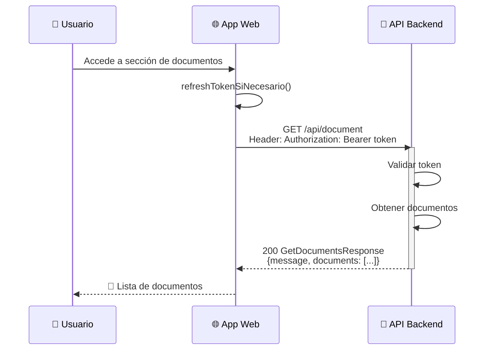
```mermaid
sequenceDiagram
    participant User as 👤 Usuario
    participant Web as 🌐 App Web
    participant API as 🔗 API Backend

    User->>Web: Accede a sección de documentos
    Web->>Web: refreshTokenSiNecesario()

    Web->>API: GET /api/document<br/>Header: Authorization: Bearer token
    activate API
    API->>API: Validar token
    API->>API: Obtener documentos
    API-->>Web: 200 GetDocumentsResponse<br/>{message, documents: [...]}
    deactivate API

    Web-->>User: 📁 Lista de documentos
```

### 9.2 Subir Documento (Solo Administradores)

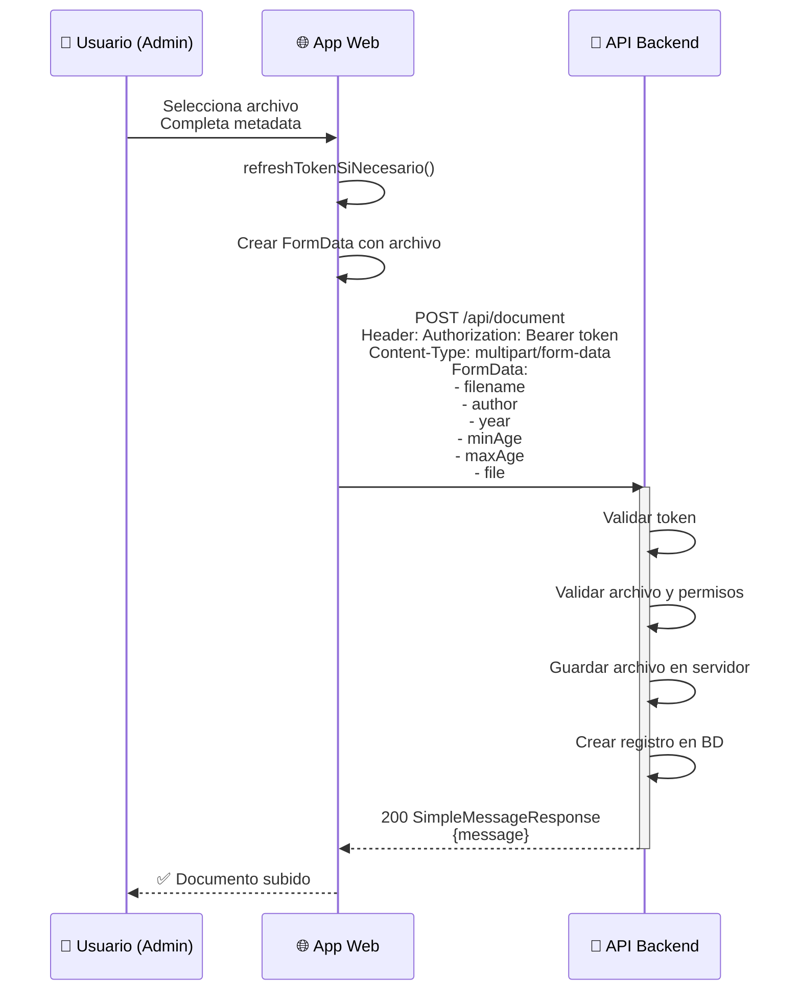
```mermaid
sequenceDiagram
    participant User as 👤 Usuario (Admin)
    participant Web as 🌐 App Web
    participant API as 🔗 API Backend

    User->>Web: Selecciona archivo<br/>Completa metadata
    Web->>Web: refreshTokenSiNecesario()
    Web->>Web: Crear FormData con archivo

    Web->>API: POST /api/document<br/>Header: Authorization: Bearer token<br/>Content-Type: multipart/form-data<br/>FormData:<br/>- filename<br/>- author<br/>- year<br/>- minAge<br/>- maxAge<br/>- file
    activate API
    API->>API: Validar token
    API->>API: Validar archivo y permisos
    API->>API: Guardar archivo en servidor
    API->>API: Crear registro en BD
    API-->>Web: 200 SimpleMessageResponse<br/>{message}
    deactivate API

    Web-->>User: ✅ Documento subido
```

### 9.3 Eliminar Documento (Solo Administradores)

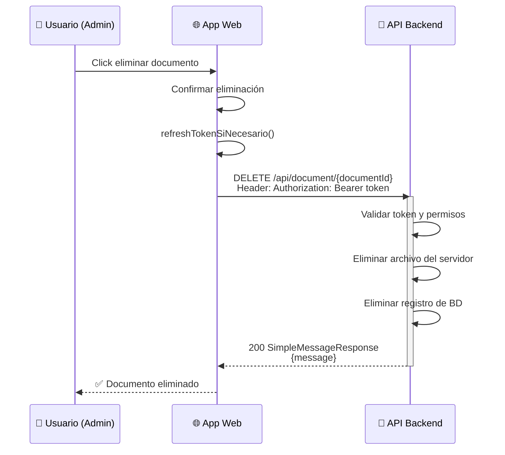
```mermaid
sequenceDiagram
    participant User as 👤 Usuario (Admin)
    participant Web as 🌐 App Web
    participant API as 🔗 API Backend

    User->>Web: Click eliminar documento
    Web->>Web: Confirmar eliminación
    Web->>Web: refreshTokenSiNecesario()

    Web->>API: DELETE /api/document/{documentId}<br/>Header: Authorization: Bearer token
    activate API
    API->>API: Validar token y permisos
    API->>API: Eliminar archivo del servidor
    API->>API: Eliminar registro de BD
    API-->>Web: 200 SimpleMessageResponse<br/>{message}
    deactivate API

    Web-->>User: ✅ Documento eliminado
```

### Tabla de Detalles de Endpoints

| Endpoint | Método | Descripción | Content-Type |
|----------|--------|-------------|--------------|
| `GET /api/document` | GET | Obtiene documentos | application/json |
| `POST /api/document` | POST | Sube nuevo documento | multipart/form-data |
| `DELETE /api/document/{documentId}` | DELETE | Elimina documento | application/json |

### Parámetros de Entrada (Subida)
```
FormData:
- filename: string
- author: string
- year: string (número como texto)
- minAge: string (número como texto)
- maxAge: string (número como texto)
- file: File (archivo binario)
```

### Respuestas
```json
// GetDocumentsResponse
{
    "message": "string",
    "documents": [
        {
            "documentid": "number",
            "userid": "number",
            "category": "number | null",
            "title": "string",
            "author": "string",
            "year": "number",
            "presignedUrl": "string (URL de descarga)"
        }
    ]
}

// SimpleMessageResponse
{
    "message": "string"
}
```

---

## 📊 Resumen de Flujos

### Mapa de Flujos Principales

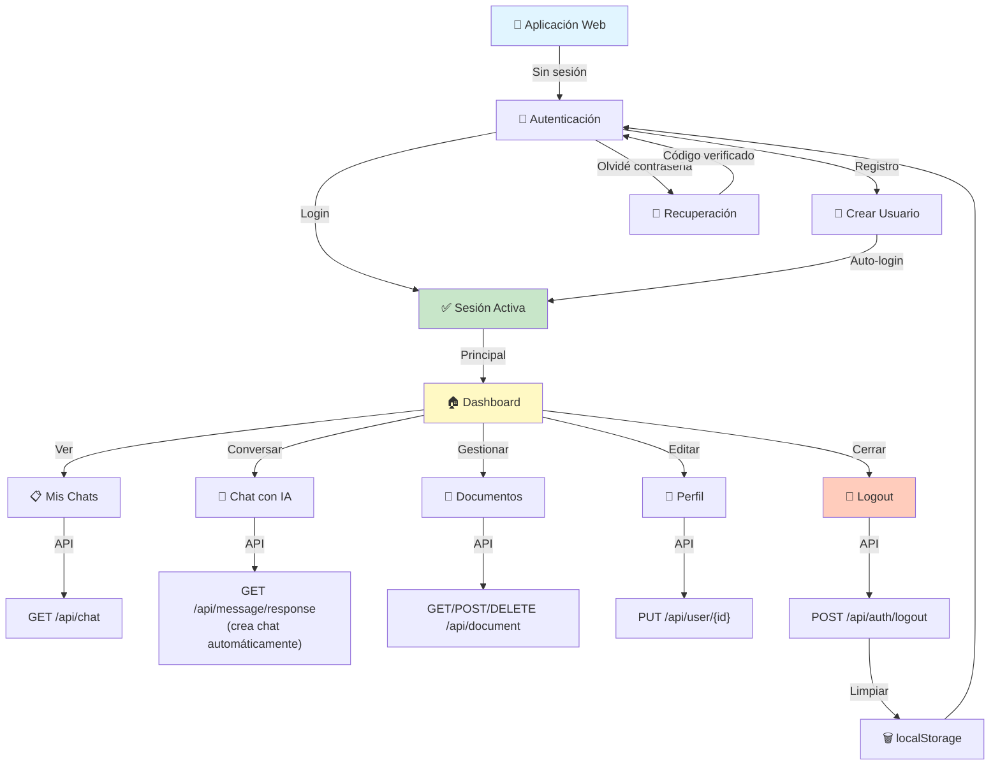
```mermaid
graph TD
    A["🚀 Aplicación Web"] -->|Sin sesión| B["🔐 Autenticación"]
    B -->|Login| C["✅ Sesión Activa"]
    B -->|Registro| D["👤 Crear Usuario"]
    D -->|Auto-login| C
    B -->|Olvidé contraseña| E["🔑 Recuperación"]
    E -->|Código verificado| B

    C -->|Principal| F["🏠 Dashboard"]
    F -->|Ver| G["📋 Mis Chats"]
    F -->|Conversar| H["🤖 Chat con IA"]
    F -->|Gestionar| I["📄 Documentos"]
    F -->|Editar| J["👤 Perfil"]

    G -->|API| K["GET /api/chat"]
    H -->|API| L["GET /api/message/response<br/>(crea chat automáticamente)"]
    I -->|API| M["GET/POST/DELETE /api/document"]
    J -->|API| N["PUT /api/user/{id}"]

    F -->|Cerrar| O["🚪 Logout"]
    O -->|API| P["POST /api/auth/logout"]
    P -->|Limpiar| Q["🗑️ localStorage"]
    Q --> B

    style A fill:#e1f5ff
    style C fill:#c8e6c9
    style F fill:#fff9c4
    style O fill:#ffccbc
```

### Flujo de Autenticación en Cada Petición

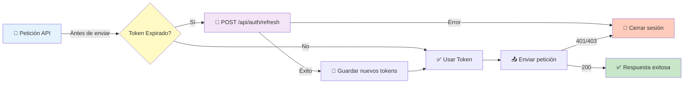
```mermaid
graph LR
    A["📡 Petición API"] -->|Antes de enviar| B{Token Expirado?}
    B -->|No| C["✅ Usar Token"]
    B -->|Sí| D["🔄 POST /api/auth/refresh"]
    D -->|Éxito| E["💾 Guardar nuevos tokens"]
    D -->|Error| F["🚪 Cerrar sesión"]
    E --> C
    C --> G["📤 Enviar petición"]
    G -->|401/403| F
    G -->|200| H["✅ Respuesta exitosa"]

    style A fill:#e3f2fd
    style B fill:#fff9c4
    style D fill:#f3e5f5
    style H fill:#c8e6c9
    style F fill:#ffccbc
```

---

## 📝 Estructura de Datos de Respuesta Global

### Respuesta Exitosa (2xx)
```json
{
    "message": "string (opcional)",
    "data": "object | array (datos específicos)"
}
```

### Respuesta de Error
```json
{
    "error": "string (descripción del error)",
    "code": "number (código HTTP)"
}
```

### Códigos de Error Comunes

| Código | Significado | Acción Recomendada |
|--------|-------------|-------------------|
| 400 | Parámetros inválidos | Validar datos del formulario |
| 401 | No autorizado | Intentar refresh token o redirigir a login |
| 403 | Prohibido | Cerrar sesión, token inválido |
| 404 | No encontrado | Recurso no existe |
| 409 | Conflicto | Email ya registrado |
| 422 | Validación fallida | Mostrar errores de validación |
| 500 | Error del servidor | Mostrar mensaje genérico, reintentar |

---

## 🔒 Consideraciones de Seguridad para Web

### Almacenamiento de Tokens
- Usar `localStorage` para persistencia entre sesiones
- Alternativa: `sessionStorage` si se prefiere cerrar sesión al cerrar navegador
- Para mayor seguridad: considerar httpOnly cookies (requiere cambios en backend)

### Device ID
- Generar UUID único con `crypto.randomUUID()`
- Almacenar en `localStorage` para mantener consistencia

### CORS
- El backend debe permitir el origen del frontend web
- Headers necesarios: `Authorization`, `Content-Type`

### Refresh Token
- Refrescar proactivamente antes de que expire (1-2 minutos antes)
- En caso de error 401/403, cerrar sesión inmediatamente

---

## 📋 Resumen de Endpoints

| Método | Endpoint | Descripción | Auth |
|--------|----------|-------------|------|
| POST | `/api/auth/login` | Iniciar sesión | ❌ |
| POST | `/api/auth/refresh` | Refrescar token | ✅ |
| POST | `/api/auth/logout` | Cerrar sesión | ✅ |
| POST | `/api/auth/sendRecovery` | Solicitar código de recuperación | ❌ |
| POST | `/api/auth/verifyCode` | Verificar código | ❌ |
| POST | `/api/auth/recoverPassword` | Restablecer contraseña | ✅ (recovery) |
| GET | `/api/user/logged` | Obtener usuario actual | ✅ |
| POST | `/api/user` | Registrar usuario | ❌ |
| PUT | `/api/user/{userId}` | Actualizar perfil | ✅ |
| GET | `/api/chat` | Listar chats | ✅ |
| GET | `/api/message/{chatId}` | Obtener mensajes | ✅ |
| POST | `/api/message/{chatId}` | Enviar mensaje a chat | ✅ |
| POST | `/api/message` | Enviar mensaje (sin chat) | ✅ |
| PUT | `/api/message/{msgId}/{chatId}` | Asignar mensaje a chat | ✅ |
| GET | `/api/message/response/{chatId}` | Obtener respuesta IA (chat existente) | ✅ |
| POST | `/api/message/response` | Obtener respuesta IA (nuevo chat) | ✅ |
| GET | `/api/document` | Listar documentos | ✅ |
| POST | `/api/document` | Subir documento | ✅ (admin) |
| DELETE | `/api/document/{docId}` | Eliminar documento | ✅ (admin) |

---

**Última actualización**: 21 de enero de 2026
**Versión**: 1.0
**Estado**: Completo ✅
