# Flujos de Llamadas a API - Cliente Web

Documento que detalla el flujo de todas las llamadas a la API del backend para las operaciones principales en aplicaciones web (React, Vue, Angular, etc.).

---

## Diferencias Clave: Web vs Mobile

| Aspecto | Web | Mobile |
|---------|-----|--------|
| Header | `X-Client-Type: web` | `X-Client-Type: mobile` |
| Refresh Token | Cookie httpOnly (automático) | JSON response (manual) |
| Device ID | UUID en localStorage | ID nativo del dispositivo |
| Credenciales | `credentials: 'include'` | Header manual |
| Almacenamiento | localStorage | DataStore + Room |
| Refresh Flow | Cookie enviada automáticamente | Body con refreshToken |

---

## Configuración Inicial: Device ID

En web no existe un identificador nativo del dispositivo como en mobile. Se recomienda generar un UUID y almacenarlo en `localStorage`:

```javascript
function getDeviceId() {
  const STORAGE_KEY = 'deviceId'
  let deviceId = localStorage.getItem(STORAGE_KEY)

  if (!deviceId) {
    deviceId = crypto.randomUUID()
    localStorage.setItem(STORAGE_KEY, deviceId)
  }

  return deviceId
}
```

**Consideraciones:**
- El `deviceId` se pierde si el usuario limpia el localStorage o usa modo incógnito
- En modo incógnito se generará un nuevo `deviceId` por sesión
- Si se requiere mayor persistencia, considerar librerías de fingerprinting como [FingerprintJS](https://fingerprint.com/)

---

## 1. Flujo de Autenticación (Login)

### Descripción General
El usuario inicia sesión con sus credenciales (email y contraseña). A diferencia de mobile, el refresh token se almacena automáticamente en una cookie httpOnly (más seguro contra XSS) y NO se devuelve en el JSON.

### Diagrama de Secuencia

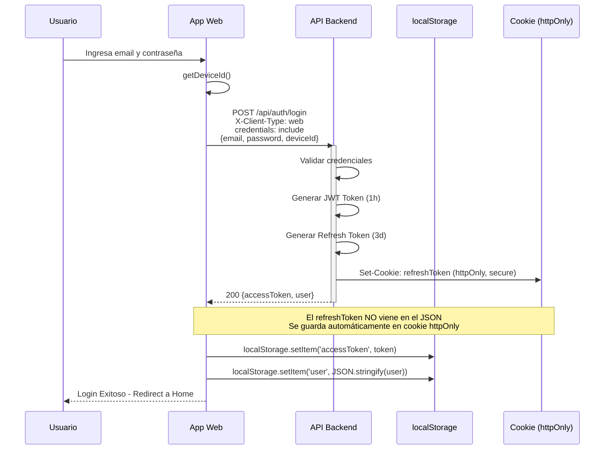
```mermaid
sequenceDiagram
    participant User as Usuario
    participant App as App Web
    participant API as API Backend
    participant Storage as localStorage
    participant Cookie as Cookie (httpOnly)

    User->>App: Ingresa email y contraseña
    App->>App: getDeviceId()
    App->>API: POST /api/auth/login<br/>X-Client-Type: web<br/>credentials: include<br/>{email, password, deviceId}
    activate API
    API->>API: Validar credenciales
    API->>API: Generar JWT Token (1h)
    API->>API: Generar Refresh Token (3d)
    API->>Cookie: Set-Cookie: refreshToken (httpOnly, secure)
    API-->>App: 200 {accessToken, user}
    deactivate API

    Note over App,Cookie: El refreshToken NO viene en el JSON<br/>Se guarda automáticamente en cookie httpOnly

    App->>Storage: localStorage.setItem('accessToken', token)
    App->>Storage: localStorage.setItem('user', JSON.stringify(user))

    App-->>User: Login Exitoso - Redirect a Home
```

### Tabla de Detalles de Endpoints

| Endpoint | Método | Descripción |
|----------|--------|-------------|
| `POST /api/auth/login` | POST | Login con email y contraseña |

### Parámetros de Entrada
```json
{
  "email": "usuario@ejemplo.com",
  "password": "contraseña123",
  "deviceId": "uuid-generado-localmente"
}
```

### Respuestas
```json
// Response 200 (Web)
{
  "message": "Login successful",
  "accessToken": "eyJhbGciOiJIUzI1NiIsInR5cCI6IkpXVCJ9...",
  "user": {
    "userId": 1,
    "email": "usuario@ejemplo.com",
    "names": "Juan",
    "lastnames": "Pérez",
    "role": "user"
  }
}
// Nota: refreshToken viene en Set-Cookie header, NO en JSON
```

### Manejo de Errores
- **401 Unauthorized**: Usuario o contraseña incorrectos
- **400 Bad Request**: Parámetros inválidos
- **500 Server Error**: Error interno del servidor

---

## 2. Flujo de Creación de Usuario (Registro)

### Descripción General
Un nuevo usuario se registra proporcionando sus datos personales. A diferencia de mobile, el registro NO hace auto-login, solo crea la cuenta.

### Diagrama de Secuencia

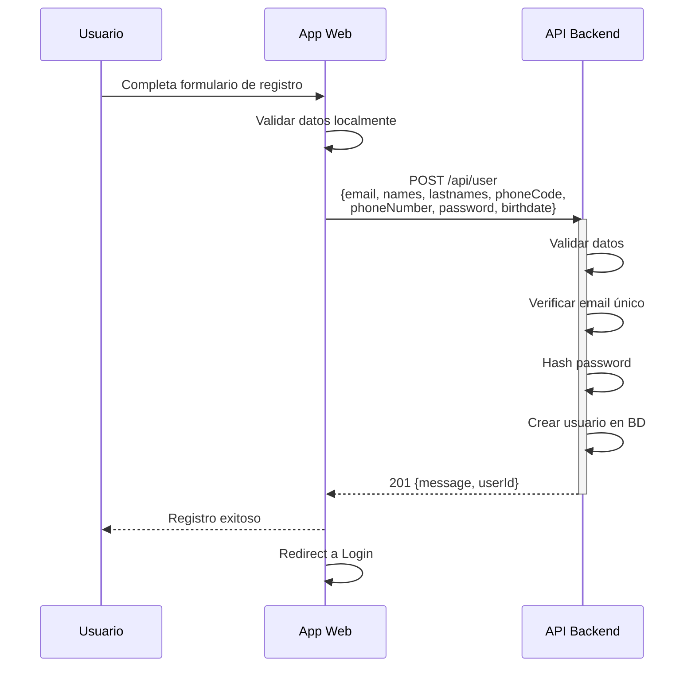
```mermaid
sequenceDiagram
    participant User as Usuario
    participant App as App Web
    participant API as API Backend

    User->>App: Completa formulario de registro
    App->>App: Validar datos localmente
    App->>API: POST /api/user<br/>{email, names, lastnames, phoneCode,<br/>phoneNumber, password, birthdate}
    activate API
    API->>API: Validar datos
    API->>API: Verificar email único
    API->>API: Hash password
    API->>API: Crear usuario en BD
    API-->>App: 201 {message, userId}
    deactivate API

    App-->>User: Registro exitoso
    App->>App: Redirect a Login
```

### Tabla de Detalles de Endpoints

| Endpoint | Método | Descripción |
|----------|--------|-------------|
| `POST /api/user` | POST | Registra un nuevo usuario |

### Parámetros de Entrada
```json
{
  "email": "nuevo@ejemplo.com",
  "names": "María",
  "lastnames": "García López",
  "phoneCode": "+502",
  "phoneNumber": "12345678",
  "password": "contraseña123",
  "birthdate": "2000-05-15"
}
```

### Respuestas
```json
// Response 201
{
  "message": "Usuario creado exitosamente",
  "userId": 2
}
```

### Manejo de Errores
- **409 Conflict**: Email ya registrado
- **400 Bad Request**: Datos inválidos
- **500 Server Error**: Error interno del servidor

---

## 3. Flujo de Creación de Chats

### Descripción General
El usuario crea un nuevo chat para iniciar una conversación. En web, el refresh token se maneja automáticamente via cookies.

### Diagrama de Secuencia

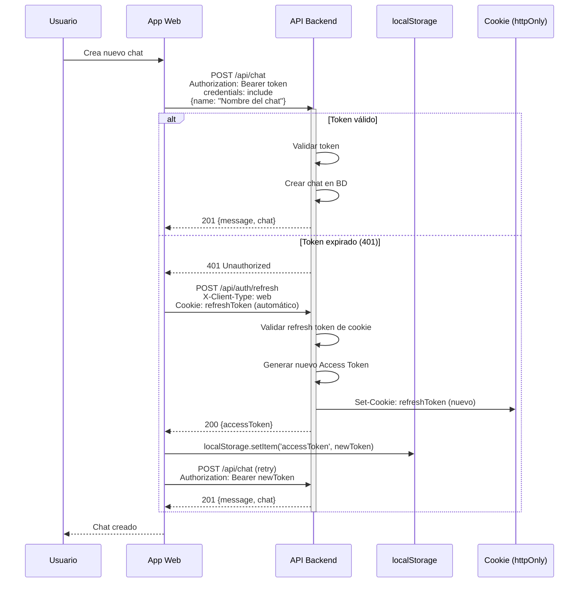
```mermaid
sequenceDiagram
    participant User as Usuario
    participant App as App Web
    participant API as API Backend
    participant Storage as localStorage
    participant Cookie as Cookie (httpOnly)

    User->>App: Crea nuevo chat

    App->>API: POST /api/chat<br/>Authorization: Bearer token<br/>credentials: include<br/>{name: "Nombre del chat"}
    activate API

    alt Token válido
        API->>API: Validar token
        API->>API: Crear chat en BD
        API-->>App: 201 {message, chat}
    else Token expirado (401)
        API-->>App: 401 Unauthorized
        App->>API: POST /api/auth/refresh<br/>X-Client-Type: web<br/>Cookie: refreshToken (automático)
        API->>API: Validar refresh token de cookie
        API->>API: Generar nuevo Access Token
        API->>Cookie: Set-Cookie: refreshToken (nuevo)
        API-->>App: 200 {accessToken}
        App->>Storage: localStorage.setItem('accessToken', newToken)
        App->>API: POST /api/chat (retry)<br/>Authorization: Bearer newToken
        API-->>App: 201 {message, chat}
    end
    deactivate API

    App-->>User: Chat creado
```

### Tabla de Detalles de Endpoints

| Endpoint | Método | Descripción |
|----------|--------|-------------|
| `POST /api/auth/refresh` | POST | Refresca el JWT token (si expira) |
| `POST /api/chat` | POST | Crea un nuevo chat |

### Parámetros de Entrada
```json
{
  "name": "Consulta sobre trámites"
}
```

### Respuestas
```json
// Response 201
{
  "message": "Chat creado exitosamente",
  "chat": {
    "chatId": 5,
    "userId": 1,
    "nombre": "Consulta sobre trámites",
    "fechaInicio": "2026-01-12T10:30:00.000Z"
  }
}
```

### Manejo de Errores
- **401 Unauthorized**: Token inválido o expirado (intentar refresh)
- **400 Bad Request**: Datos inválidos
- **500 Server Error**: Error interno del servidor

---

## 4. Flujo de Seguimiento de Chats (Obtener Chats)

### Descripción General
El usuario obtiene la lista de todos sus chats con paginación.

### Diagrama de Secuencia

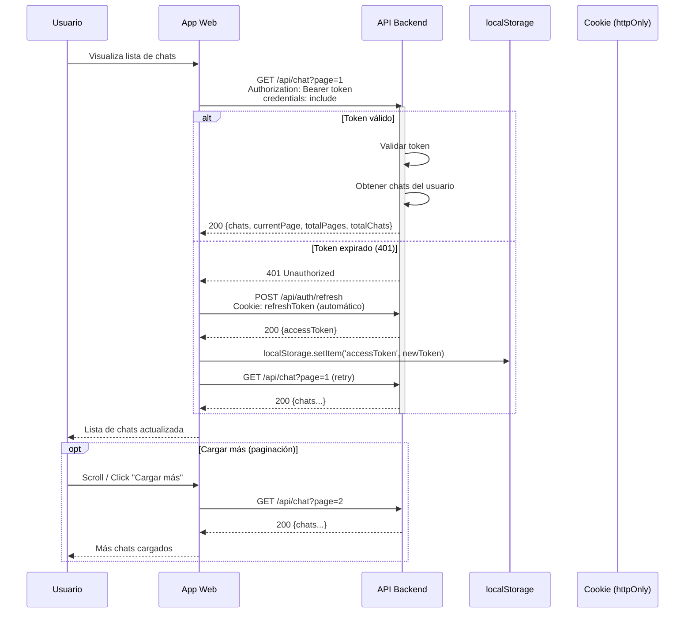
```mermaid
sequenceDiagram
    participant User as Usuario
    participant App as App Web
    participant API as API Backend
    participant Storage as localStorage
    participant Cookie as Cookie (httpOnly)

    User->>App: Visualiza lista de chats

    App->>API: GET /api/chat?page=1<br/>Authorization: Bearer token<br/>credentials: include
    activate API

    alt Token válido
        API->>API: Validar token
        API->>API: Obtener chats del usuario
        API-->>App: 200 {chats, currentPage, totalPages, totalChats}
    else Token expirado (401)
        API-->>App: 401 Unauthorized
        App->>API: POST /api/auth/refresh<br/>Cookie: refreshToken (automático)
        API-->>App: 200 {accessToken}
        App->>Storage: localStorage.setItem('accessToken', newToken)
        App->>API: GET /api/chat?page=1 (retry)
        API-->>App: 200 {chats...}
    end
    deactivate API

    App-->>User: Lista de chats actualizada

    opt Cargar más (paginación)
        User->>App: Scroll / Click "Cargar más"
        App->>API: GET /api/chat?page=2
        API-->>App: 200 {chats...}
        App-->>User: Más chats cargados
    end
```

### Tabla de Detalles de Endpoints

| Endpoint | Método | Descripción |
|----------|--------|-------------|
| `POST /api/auth/refresh` | POST | Refresca el JWT token (si expira) |
| `GET /api/chat` | GET | Obtiene chats del usuario |

### Respuestas
```json
// Response 200
{
  "chats": [
    {
      "chatId": 5,
      "userId": 1,
      "nombre": "Consulta sobre trámites",
      "fechaInicio": "2026-01-12T10:30:00.000Z",
      "lastMessageContent": "¿Cómo solicito mi DPI?",
      "lastMessageTimestamp": "2026-01-12T10:45:00.000Z",
      "lastMessageSource": "user"
    }
  ],
  "currentPage": 1,
  "totalPages": 3,
  "totalChats": 25
}
```

### Manejo de Errores
- **401 Unauthorized**: Token inválido o expirado
- **500 Server Error**: Error interno del servidor

---

## 5. Flujo de Mensajes en Chats

### 5.1 Obtener Mensajes de un Chat

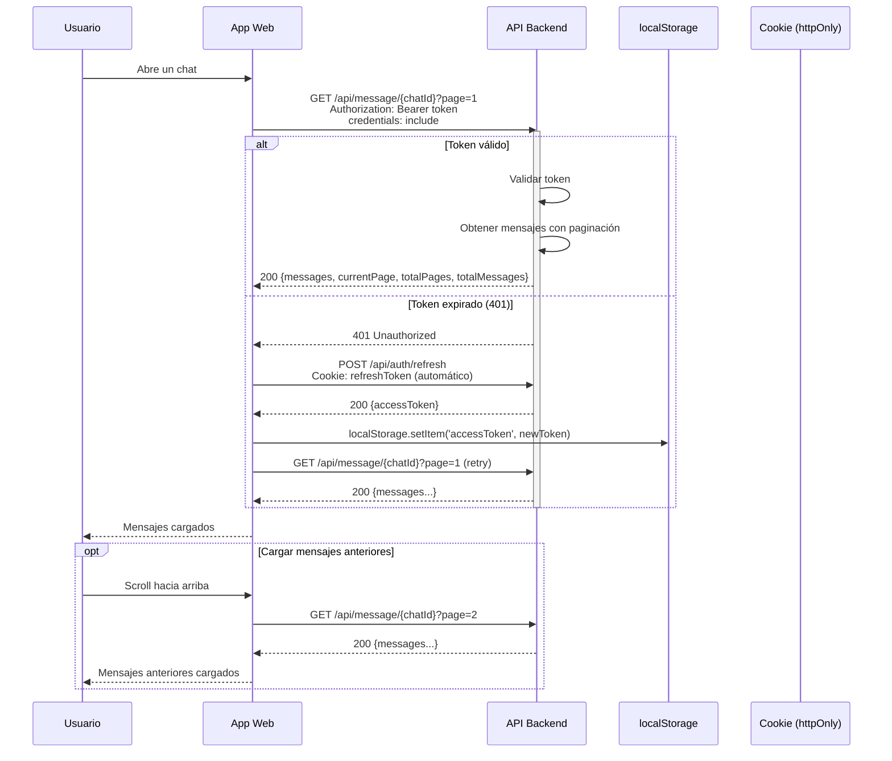
```mermaid
sequenceDiagram
    participant User as Usuario
    participant App as App Web
    participant API as API Backend
    participant Storage as localStorage
    participant Cookie as Cookie (httpOnly)

    User->>App: Abre un chat

    App->>API: GET /api/message/{chatId}?page=1<br/>Authorization: Bearer token<br/>credentials: include
    activate API

    alt Token válido
        API->>API: Validar token
        API->>API: Obtener mensajes con paginación
        API-->>App: 200 {messages, currentPage, totalPages, totalMessages}
    else Token expirado (401)
        API-->>App: 401 Unauthorized
        App->>API: POST /api/auth/refresh<br/>Cookie: refreshToken (automático)
        API-->>App: 200 {accessToken}
        App->>Storage: localStorage.setItem('accessToken', newToken)
        App->>API: GET /api/message/{chatId}?page=1 (retry)
        API-->>App: 200 {messages...}
    end
    deactivate API

    App-->>User: Mensajes cargados

    opt Cargar mensajes anteriores
        User->>App: Scroll hacia arriba
        App->>API: GET /api/message/{chatId}?page=2
        API-->>App: 200 {messages...}
        App-->>User: Mensajes anteriores cargados
    end
```

### 5.2 Crear Mensaje en Chat

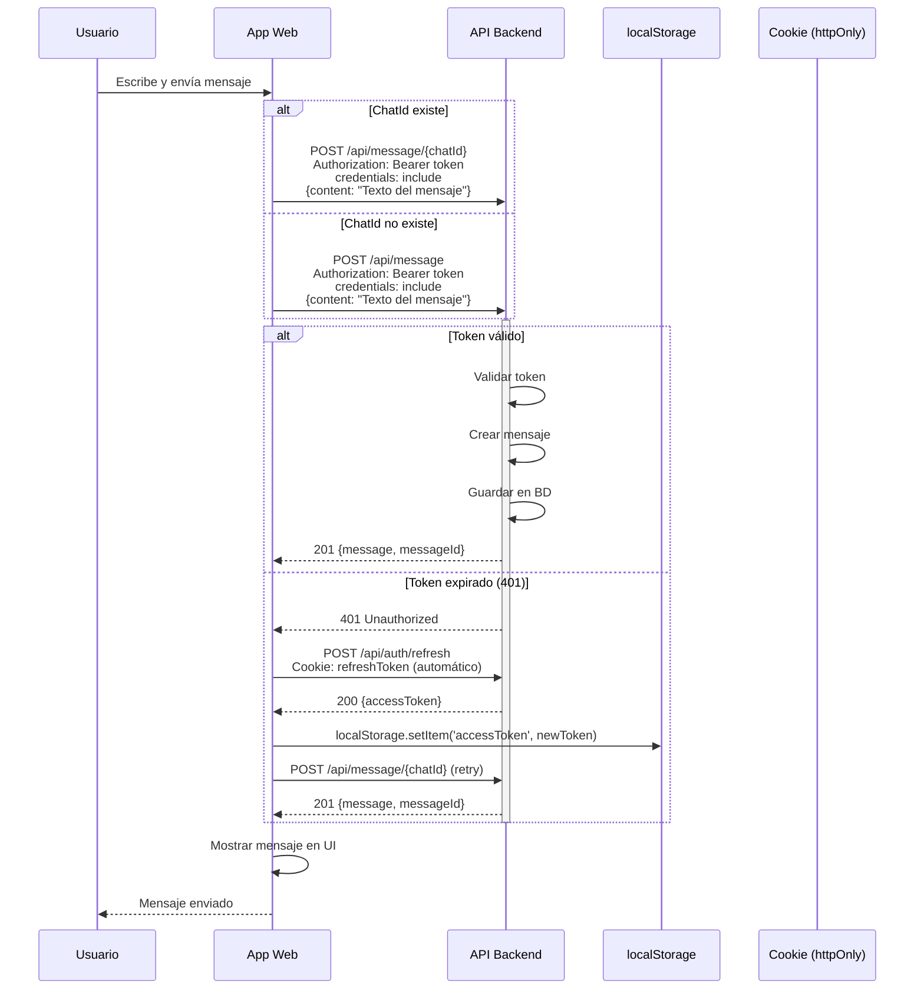
```mermaid
sequenceDiagram
    participant User as Usuario
    participant App as App Web
    participant API as API Backend
    participant Storage as localStorage
    participant Cookie as Cookie (httpOnly)

    User->>App: Escribe y envía mensaje

    alt ChatId existe
        App->>API: POST /api/message/{chatId}<br/>Authorization: Bearer token<br/>credentials: include<br/>{content: "Texto del mensaje"}
    else ChatId no existe
        App->>API: POST /api/message<br/>Authorization: Bearer token<br/>credentials: include<br/>{content: "Texto del mensaje"}
    end

    activate API

    alt Token válido
        API->>API: Validar token
        API->>API: Crear mensaje
        API->>API: Guardar en BD
        API-->>App: 201 {message, messageId}
    else Token expirado (401)
        API-->>App: 401 Unauthorized
        App->>API: POST /api/auth/refresh<br/>Cookie: refreshToken (automático)
        API-->>App: 200 {accessToken}
        App->>Storage: localStorage.setItem('accessToken', newToken)
        App->>API: POST /api/message/{chatId} (retry)
        API-->>App: 201 {message, messageId}
    end
    deactivate API

    App->>App: Mostrar mensaje en UI
    App-->>User: Mensaje enviado
```

### 5.3 Obtener Respuesta de IA (Message Response)

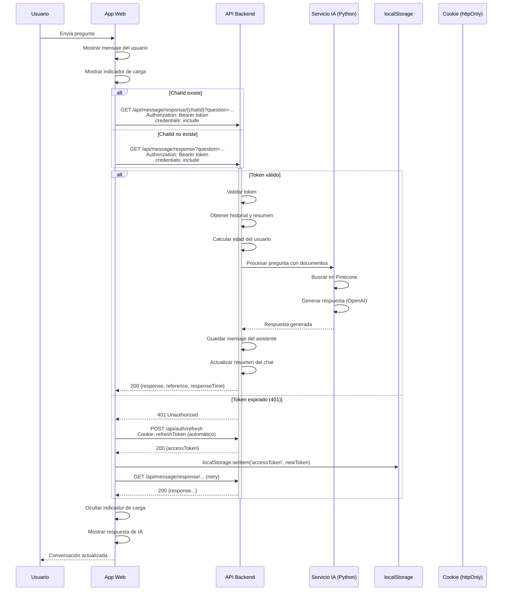
```mermaid
sequenceDiagram
    participant User as Usuario
    participant App as App Web
    participant API as API Backend
    participant AI as Servicio IA (Python)
    participant Storage as localStorage
    participant Cookie as Cookie (httpOnly)

    User->>App: Envía pregunta
    App->>App: Mostrar mensaje del usuario
    App->>App: Mostrar indicador de carga

    alt ChatId existe
        App->>API: GET /api/message/response/{chatId}?question=...<br/>Authorization: Bearer token<br/>credentials: include
    else ChatId no existe
        App->>API: GET /api/message/response?question=...<br/>Authorization: Bearer token<br/>credentials: include
    end

    activate API

    alt Token válido
        API->>API: Validar token
        API->>API: Obtener historial y resumen
        API->>API: Calcular edad del usuario
        API->>AI: Procesar pregunta con documentos
        AI->>AI: Buscar en Pinecone
        AI->>AI: Generar respuesta (OpenAI)
        AI-->>API: Respuesta generada
        API->>API: Guardar mensaje del asistente
        API->>API: Actualizar resumen del chat
        API-->>App: 200 {response, reference, responseTime}
    else Token expirado (401)
        API-->>App: 401 Unauthorized
        App->>API: POST /api/auth/refresh<br/>Cookie: refreshToken (automático)
        API-->>App: 200 {accessToken}
        App->>Storage: localStorage.setItem('accessToken', newToken)
        App->>API: GET /api/message/response/... (retry)
        API-->>App: 200 {response...}
    end
    deactivate API

    App->>App: Ocultar indicador de carga
    App->>App: Mostrar respuesta de IA
    App-->>User: Conversación actualizada
```

### Tabla de Detalles de Endpoints

| Endpoint | Método | Descripción | Parámetros |
|----------|--------|-------------|-----------|
| `GET /api/message/{chatId}` | GET | Obtiene mensajes del chat | `page` |
| `POST /api/message/{chatId}` | POST | Crea mensaje en chat existente | Body: `{content}` |
| `POST /api/message` | POST | Crea mensaje sin chat asignado | Body: `{content}` |
| `GET /api/message/response/{chatId}` | GET | Obtiene respuesta IA para chat | `question` (query param) |
| `GET /api/message/response` | GET | Obtiene respuesta IA sin chat | `question` (query param) |
| `PUT /api/message/{messageId}/{chatId}` | PUT | Asigna mensaje a chat | - |

### Parámetros de Entrada
```json
{
  "content": "¿Cómo solicito mi DPI?"
}
```

### Respuestas
```json
// GetChatMessagesResponse
{
  "messages": [
    {
      "messageId": 42,
      "chatId": 5,
      "source": "user",
      "content": "¿Cómo solicito mi DPI?",
      "timestamp": "2026-01-12T10:45:00.000Z",
      "reference": null,
      "responseTime": null
    }
  ],
  "currentPage": 1,
  "totalPages": 2,
  "totalMessages": 35
}

// NewMessageResponse
{
  "message": "Mensaje creado exitosamente",
  "messageId": 42
}

// AI Response
{
  "response": "Para solicitar tu DPI debes...",
  "reference": "Documento: Guía de trámites DPI",
  "responseTime": 2450
}
```

---

## 6. Flujo de Documentos (Solo Admin)

### 6.1 Obtener Documentos

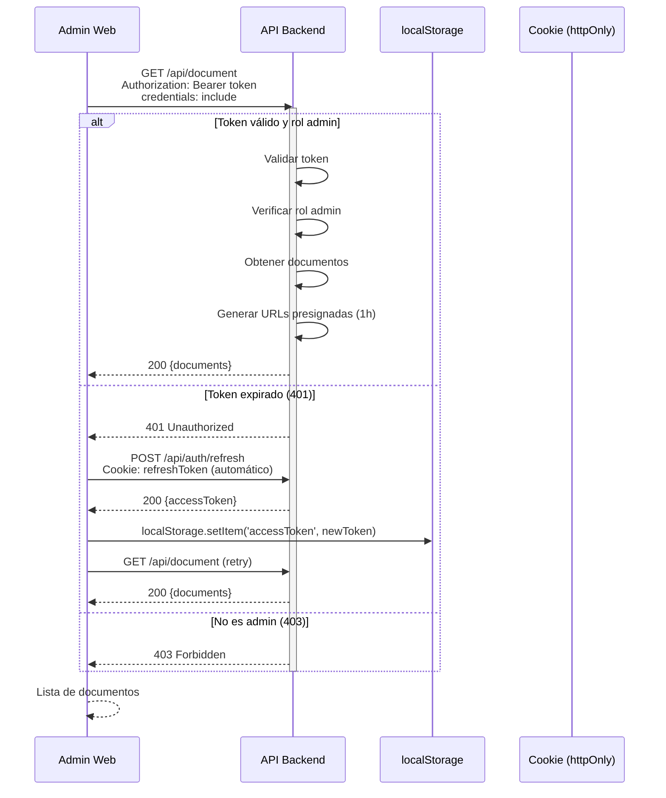
```mermaid
sequenceDiagram
    participant Admin as Admin Web
    participant API as API Backend
    participant Storage as localStorage
    participant Cookie as Cookie (httpOnly)

    Admin->>API: GET /api/document<br/>Authorization: Bearer token<br/>credentials: include
    activate API

    alt Token válido y rol admin
        API->>API: Validar token
        API->>API: Verificar rol admin
        API->>API: Obtener documentos
        API->>API: Generar URLs presignadas (1h)
        API-->>Admin: 200 {documents}
    else Token expirado (401)
        API-->>Admin: 401 Unauthorized
        Admin->>API: POST /api/auth/refresh<br/>Cookie: refreshToken (automático)
        API-->>Admin: 200 {accessToken}
        Admin->>Storage: localStorage.setItem('accessToken', newToken)
        Admin->>API: GET /api/document (retry)
        API-->>Admin: 200 {documents}
    else No es admin (403)
        API-->>Admin: 403 Forbidden
    end
    deactivate API

    Admin-->>Admin: Lista de documentos
```

### 6.2 Subir Documento

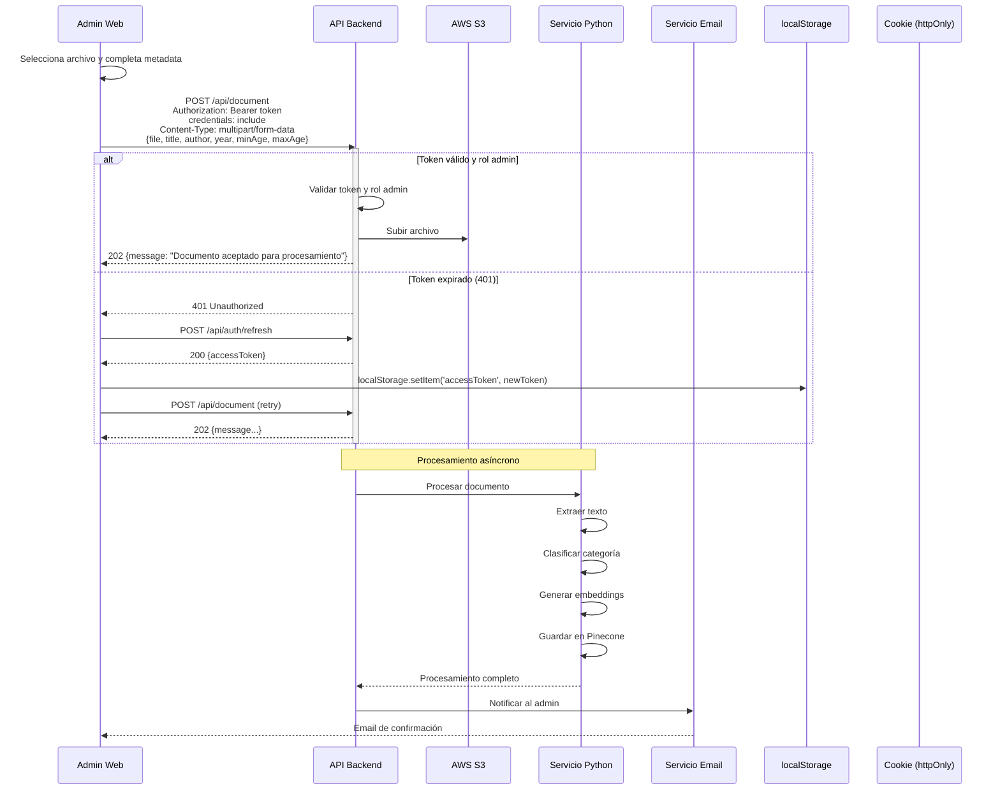
```mermaid
sequenceDiagram
    participant Admin as Admin Web
    participant API as API Backend
    participant S3 as AWS S3
    participant Python as Servicio Python
    participant Email as Servicio Email
    participant Storage as localStorage
    participant Cookie as Cookie (httpOnly)

    Admin->>Admin: Selecciona archivo y completa metadata

    Admin->>API: POST /api/document<br/>Authorization: Bearer token<br/>credentials: include<br/>Content-Type: multipart/form-data<br/>{file, title, author, year, minAge, maxAge}
    activate API

    alt Token válido y rol admin
        API->>API: Validar token y rol admin
        API->>S3: Subir archivo
        API-->>Admin: 202 {message: "Documento aceptado para procesamiento"}
    else Token expirado (401)
        API-->>Admin: 401 Unauthorized
        Admin->>API: POST /api/auth/refresh
        API-->>Admin: 200 {accessToken}
        Admin->>Storage: localStorage.setItem('accessToken', newToken)
        Admin->>API: POST /api/document (retry)
        API-->>Admin: 202 {message...}
    end
    deactivate API

    Note over API,Python: Procesamiento asíncrono

    API->>Python: Procesar documento
    Python->>Python: Extraer texto
    Python->>Python: Clasificar categoría
    Python->>Python: Generar embeddings
    Python->>Python: Guardar en Pinecone
    Python-->>API: Procesamiento completo

    API->>Email: Notificar al admin
    Email-->>Admin: Email de confirmación
```

### 6.3 Eliminar Documento

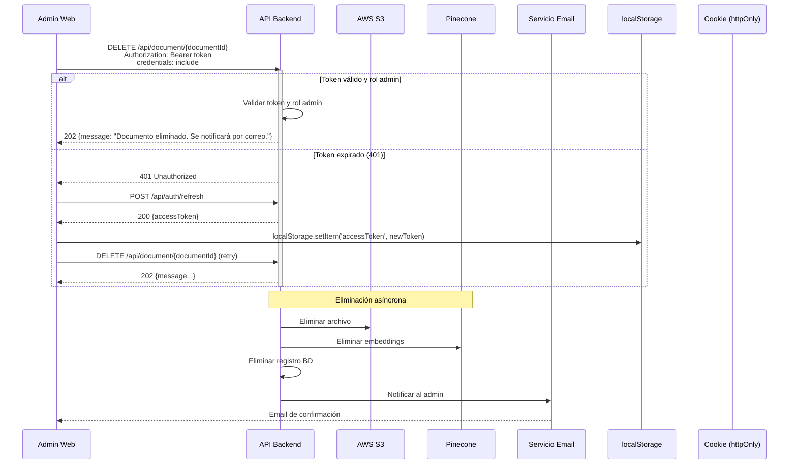
```mermaid
sequenceDiagram
    participant Admin as Admin Web
    participant API as API Backend
    participant S3 as AWS S3
    participant Pinecone as Pinecone
    participant Email as Servicio Email
    participant Storage as localStorage
    participant Cookie as Cookie (httpOnly)

    Admin->>API: DELETE /api/document/{documentId}<br/>Authorization: Bearer token<br/>credentials: include
    activate API

    alt Token válido y rol admin
        API->>API: Validar token y rol admin
        API-->>Admin: 202 {message: "Documento eliminado. Se notificará por correo."}
    else Token expirado (401)
        API-->>Admin: 401 Unauthorized
        Admin->>API: POST /api/auth/refresh
        API-->>Admin: 200 {accessToken}
        Admin->>Storage: localStorage.setItem('accessToken', newToken)
        Admin->>API: DELETE /api/document/{documentId} (retry)
        API-->>Admin: 202 {message...}
    end
    deactivate API

    Note over API,Pinecone: Eliminación asíncrona

    API->>S3: Eliminar archivo
    API->>Pinecone: Eliminar embeddings
    API->>API: Eliminar registro BD

    API->>Email: Notificar al admin
    Email-->>Admin: Email de confirmación
```

### Tabla de Detalles de Endpoints

| Endpoint | Método | Descripción | Content-Type |
|----------|--------|-------------|--------------|
| `GET /api/document` | GET | Obtiene documentos (admin) | JSON |
| `POST /api/document` | POST | Carga nuevo documento (admin) | Multipart/form-data |
| `DELETE /api/document/{documentId}` | DELETE | Elimina documento (admin) | JSON |

---

## 7. Flujo de Refresco de Token (Token Refresh)

### Descripción General
En web, el refresh token se maneja automáticamente via cookies httpOnly. El navegador envía la cookie automáticamente con `credentials: 'include'`.

### Diagrama de Secuencia

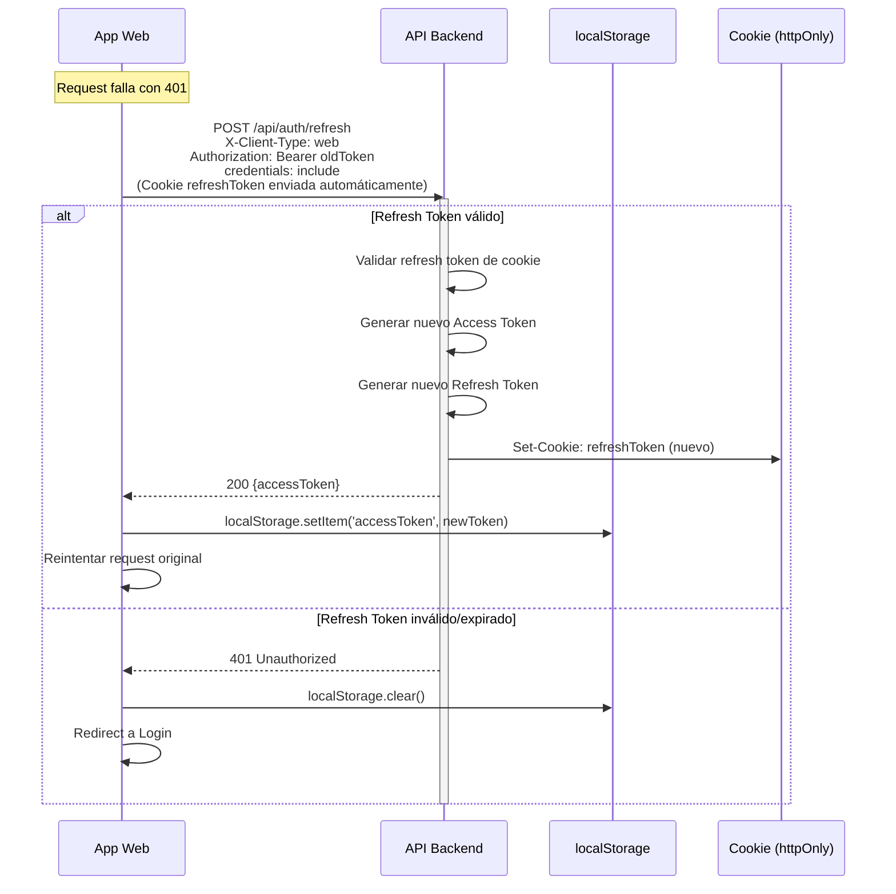
```mermaid
sequenceDiagram
    participant App as App Web
    participant API as API Backend
    participant Storage as localStorage
    participant Cookie as Cookie (httpOnly)

    Note over App: Request falla con 401

    App->>API: POST /api/auth/refresh<br/>X-Client-Type: web<br/>Authorization: Bearer oldToken<br/>credentials: include<br/>(Cookie refreshToken enviada automáticamente)
    activate API

    alt Refresh Token válido
        API->>API: Validar refresh token de cookie
        API->>API: Generar nuevo Access Token
        API->>API: Generar nuevo Refresh Token
        API->>Cookie: Set-Cookie: refreshToken (nuevo)
        API-->>App: 200 {accessToken}
        App->>Storage: localStorage.setItem('accessToken', newToken)
        App->>App: Reintentar request original
    else Refresh Token inválido/expirado
        API-->>App: 401 Unauthorized
        App->>Storage: localStorage.clear()
        App->>App: Redirect a Login
    end
    deactivate API
```

### Diferencia con Mobile

| Aspecto | Web | Mobile |
|---------|-----|--------|
| Envío de refresh token | Cookie (automático) | Body `{refreshToken}` (manual) |
| Recepción de nuevo refresh | Set-Cookie (automático) | JSON response (guardar manual) |
| Almacenamiento | Cookie httpOnly (no accesible JS) | DataStore (accesible) |

---

## 8. Flujo de Recuperación de Contraseña

### Descripción General
Usuario olvida su contraseña. Se envía un código de verificación por email, se valida, y se establece una nueva contraseña.

### Diagrama de Secuencia

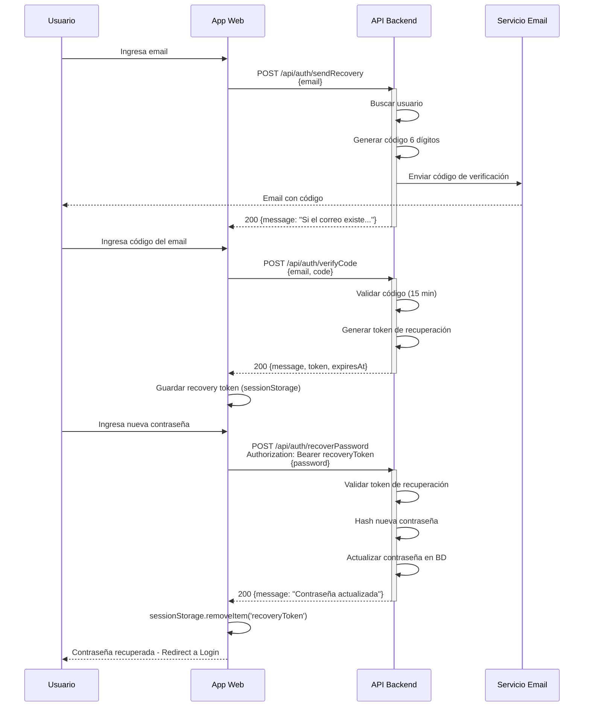
```mermaid
sequenceDiagram
    participant User as Usuario
    participant App as App Web
    participant API as API Backend
    participant Email as Servicio Email

    User->>App: Ingresa email
    App->>API: POST /api/auth/sendRecovery<br/>{email}
    activate API
    API->>API: Buscar usuario
    API->>API: Generar código 6 dígitos
    API->>Email: Enviar código de verificación
    Email-->>User: Email con código
    API-->>App: 200 {message: "Si el correo existe..."}
    deactivate API

    User->>App: Ingresa código del email
    App->>API: POST /api/auth/verifyCode<br/>{email, code}
    activate API
    API->>API: Validar código (15 min)
    API->>API: Generar token de recuperación
    API-->>App: 200 {message, token, expiresAt}
    deactivate API

    App->>App: Guardar recovery token (sessionStorage)

    User->>App: Ingresa nueva contraseña
    App->>API: POST /api/auth/recoverPassword<br/>Authorization: Bearer recoveryToken<br/>{password}
    activate API
    API->>API: Validar token de recuperación
    API->>API: Hash nueva contraseña
    API->>API: Actualizar contraseña en BD
    API-->>App: 200 {message: "Contraseña actualizada"}
    deactivate API

    App->>App: sessionStorage.removeItem('recoveryToken')
    App-->>User: Contraseña recuperada - Redirect a Login
```

### Tabla de Detalles de Endpoints

| Endpoint | Método | Descripción |
|----------|--------|-------------|
| `POST /api/auth/sendRecovery` | POST | Envía código de verificación |
| `POST /api/auth/verifyCode` | POST | Valida código y obtiene token de recuperación |
| `POST /api/auth/recoverPassword` | POST | Establece nueva contraseña |

### Parámetros de Entrada
```json
// Send Recovery
{ "email": "usuario@ejemplo.com" }

// Verify Code
{ "email": "usuario@ejemplo.com", "code": "123456" }

// Recover Password
{ "password": "nueva_contraseña_segura" }
```

---

## 9. Flujo de Logout

### Diagrama de Secuencia

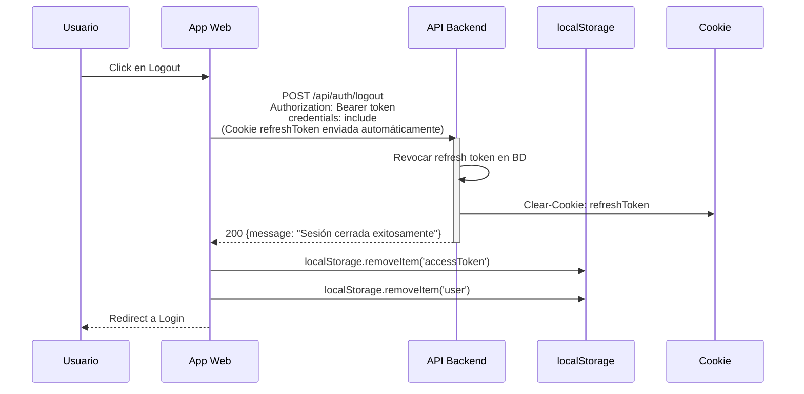
```mermaid
sequenceDiagram
    participant User as Usuario
    participant App as App Web
    participant API as API Backend
    participant Storage as localStorage
    participant Cookie as Cookie

    User->>App: Click en Logout
    App->>API: POST /api/auth/logout<br/>Authorization: Bearer token<br/>credentials: include<br/>(Cookie refreshToken enviada automáticamente)
    activate API
    API->>API: Revocar refresh token en BD
    API->>Cookie: Clear-Cookie: refreshToken
    API-->>App: 200 {message: "Sesión cerrada exitosamente"}
    deactivate API

    App->>Storage: localStorage.removeItem('accessToken')
    App->>Storage: localStorage.removeItem('user')
    App-->>User: Redirect a Login
```

---

## Resumen de Endpoints

| Endpoint | Método | Auth | Descripción |
|----------|--------|------|-------------|
| `/api/auth/login` | POST | No | Login |
| `/api/auth/refresh` | POST | Si | Refrescar token |
| `/api/auth/logout` | POST | Si | Cerrar sesión |
| `/api/auth/sendRecovery` | POST | No | Enviar código recuperación |
| `/api/auth/verifyCode` | POST | No | Verificar código |
| `/api/auth/recoverPassword` | POST | Recovery Token | Nueva contraseña |
| `/api/user` | POST | No | Registro |
| `/api/user/logged` | GET | Si | Usuario actual |
| `/api/user/:userId` | PUT | Si | Actualizar perfil |
| `/api/chat` | GET | Si | Listar chats |
| `/api/chat` | POST | Si | Crear chat |
| `/api/message/:chatId` | GET | Si | Listar mensajes |
| `/api/message/:chatId` | POST | Si | Crear mensaje |
| `/api/message` | POST | Si | Crear mensaje sin chat |
| `/api/message/response/:chatId` | GET | Si | Respuesta IA |
| `/api/message/response` | GET | Si | Respuesta IA sin chat |
| `/api/message/:messageId/:chatId` | PUT | Si | Asignar mensaje a chat |
| `/api/document` | GET | Admin | Listar documentos |
| `/api/document` | POST | Admin | Subir documento |
| `/api/document/:documentId` | DELETE | Admin | Eliminar documento |

---

## Notas Importantes para Web

1. **Siempre usar `credentials: 'include'`** en todas las requests para que el navegador envíe/reciba cookies
2. **El refreshToken nunca es accesible desde JavaScript** - está en una cookie httpOnly
3. **Manejar 401 automáticamente** - intentar refresh antes de redirigir a login
4. **Header `X-Client-Type: web`** - indica al servidor que use cookies para refresh token
5. **deviceId en localStorage** - se pierde en incógnito o al limpiar datos

---

**Última actualización**: 21 de enero de 2026
**Versión**: 1.0
