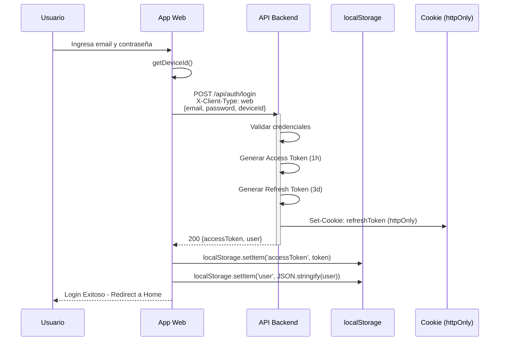
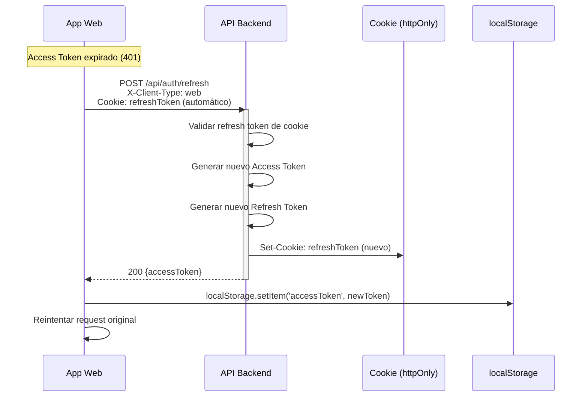
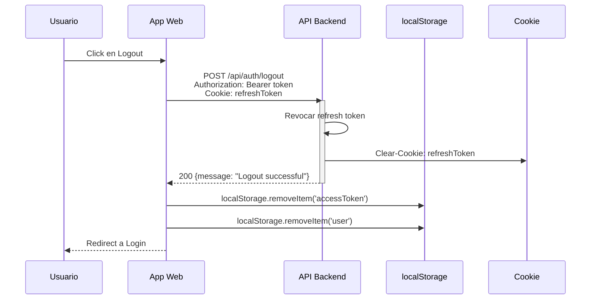
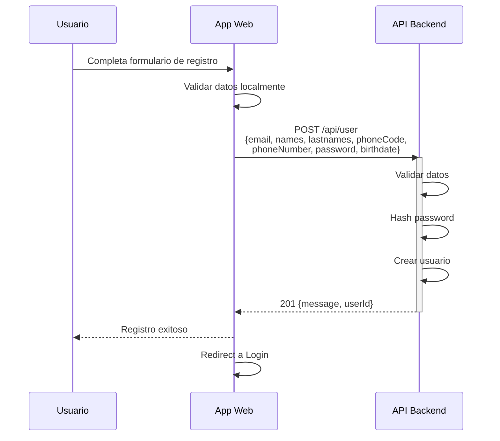
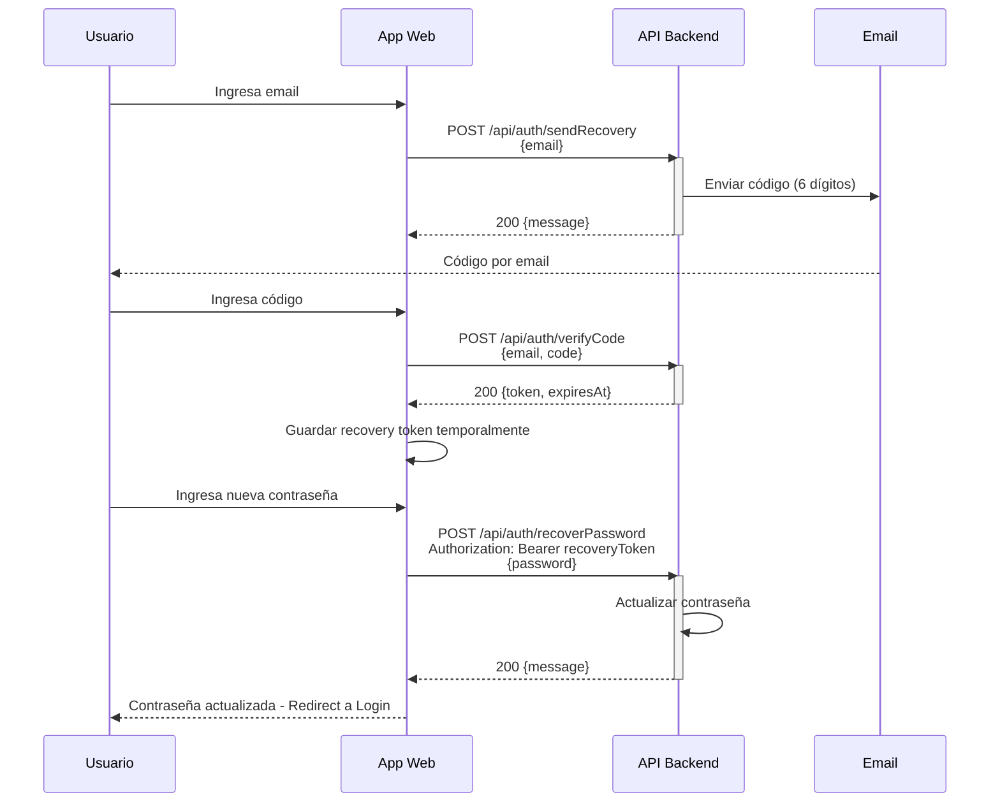
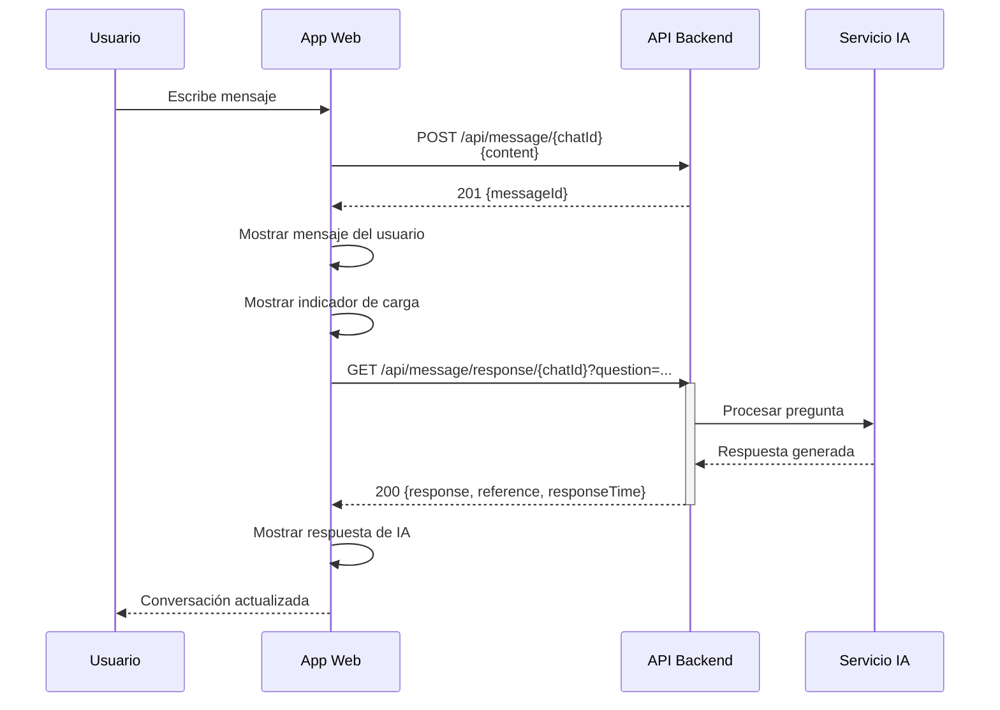

# Flujos de Llamadas a API - Cliente Web

Documento que detalla el flujo de todas las llamadas a la API del backend para las operaciones principales en aplicaciones web (React, Vue, Angular, etc.).

---

## Diferencias Clave: Web vs Mobile

| Aspecto | Web | Mobile |
|---------|-----|--------|
| Header | `X-Client-Type: web` | `X-Client-Type: mobile` |
| Refresh Token | Cookie httpOnly (automático) | JSON response (manual) |
| Device ID | UUID en localStorage | ID nativo del dispositivo |
| Credenciales | `credentials: 'include'` | Header manual |

---

## Configuración Inicial

### Función para obtener Device ID

```javascript
function getDeviceId() {
  const STORAGE_KEY = 'deviceId'
  let deviceId = localStorage.getItem(STORAGE_KEY)

  if (!deviceId) {
    deviceId = crypto.randomUUID()
    localStorage.setItem(STORAGE_KEY, deviceId)
  }

  return deviceId
}
```

### Cliente HTTP Base

```javascript
const API_BASE_URL = 'http://localhost:3000/api'

async function apiRequest(endpoint, options = {}) {
  const token = localStorage.getItem('accessToken')

  const config = {
    ...options,
    credentials: 'include', // Importante para cookies
    headers: {
      'Content-Type': 'application/json',
      'X-Client-Type': 'web',
      ...(token && { 'Authorization': `Bearer ${token}` }),
      ...options.headers
    }
  }

  const response = await fetch(`${API_BASE_URL}${endpoint}`, config)

  if (response.status === 401) {
    // Token expirado, intentar refresh
    const refreshed = await refreshToken()
    if (refreshed) {
      // Reintentar request original
      return apiRequest(endpoint, options)
    } else {
      // Redirect a login
      window.location.href = '/login'
      throw new Error('Session expired')
    }
  }

  return response
}
```

---

## 1. Flujo de Autenticación (Login)

### Diagrama de Secuencia



### Implementación

```javascript
async function login(email, password) {
  const response = await fetch(`${API_BASE_URL}/api/auth/login`, {
    method: 'POST',
    credentials: 'include',
    headers: {
      'Content-Type': 'application/json',
      'X-Client-Type': 'web'
    },
    body: JSON.stringify({
      email,
      password,
      deviceId: getDeviceId()
    })
  })

  if (!response.ok) {
    const error = await response.json()
    throw new Error(error.error || 'Login failed')
  }

  const data = await response.json()

  // Guardar access token (refresh token ya está en cookie httpOnly)
  localStorage.setItem('accessToken', data.accessToken)
  localStorage.setItem('user', JSON.stringify(data.user))

  return data
}
```

---

## 2. Flujo de Refresh Token

El refresh token se maneja automáticamente via cookies httpOnly, lo que significa que:
- El navegador lo envía automáticamente con `credentials: 'include'`
- No es accesible desde JavaScript (protección contra XSS)
- Se renueva automáticamente

### Diagrama de Secuencia



### Implementación

```javascript
async function refreshToken() {
  try {
    const response = await fetch(`${API_BASE_URL}/api/auth/refresh`, {
      method: 'POST',
      credentials: 'include', // Envía la cookie automáticamente
      headers: {
        'Content-Type': 'application/json',
        'X-Client-Type': 'web',
        'Authorization': `Bearer ${localStorage.getItem('accessToken')}`
      }
    })

    if (!response.ok) {
      return false
    }

    const data = await response.json()
    localStorage.setItem('accessToken', data.accessToken)
    return true
  } catch (error) {
    return false
  }
}
```

---

## 3. Flujo de Logout

### Diagrama de Secuencia



### Implementación

```javascript
async function logout() {
  try {
    await fetch(`${API_BASE_URL}/api/auth/logout`, {
      method: 'POST',
      credentials: 'include',
      headers: {
        'Content-Type': 'application/json',
        'X-Client-Type': 'web',
        'Authorization': `Bearer ${localStorage.getItem('accessToken')}`
      }
    })
  } finally {
    // Limpiar storage incluso si falla el request
    localStorage.removeItem('accessToken')
    localStorage.removeItem('user')
    window.location.href = '/login'
  }
}
```

---

## 4. Flujo de Registro

### Diagrama de Secuencia



### Implementación

```javascript
async function register(userData) {
  const response = await fetch(`${API_BASE_URL}/api/user`, {
    method: 'POST',
    headers: {
      'Content-Type': 'application/json'
    },
    body: JSON.stringify({
      email: userData.email,
      names: userData.names,
      lastnames: userData.lastnames,
      phoneCode: userData.phoneCode,
      phoneNumber: userData.phoneNumber,
      password: userData.password,
      birthdate: userData.birthdate // Formato: YYYY-MM-DD
    })
  })

  if (!response.ok) {
    const error = await response.json()
    throw new Error(error.error || 'Registration failed')
  }

  return response.json()
}
```

---

## 5. Flujo de Recuperación de Contraseña

### Diagrama de Secuencia



### Implementación

```javascript
// Paso 1: Solicitar código
async function requestRecoveryCode(email) {
  const response = await fetch(`${API_BASE_URL}/api/auth/sendRecovery`, {
    method: 'POST',
    headers: { 'Content-Type': 'application/json' },
    body: JSON.stringify({ email })
  })
  return response.json()
}

// Paso 2: Verificar código
async function verifyRecoveryCode(email, code) {
  const response = await fetch(`${API_BASE_URL}/api/auth/verifyCode`, {
    method: 'POST',
    headers: { 'Content-Type': 'application/json' },
    body: JSON.stringify({ email, code })
  })

  if (!response.ok) {
    throw new Error('Invalid or expired code')
  }

  const data = await response.json()
  // Guardar token temporalmente (válido por 15 min)
  sessionStorage.setItem('recoveryToken', data.token)
  return data
}

// Paso 3: Establecer nueva contraseña
async function resetPassword(password) {
  const recoveryToken = sessionStorage.getItem('recoveryToken')

  const response = await fetch(`${API_BASE_URL}/api/auth/recoverPassword`, {
    method: 'POST',
    headers: {
      'Content-Type': 'application/json',
      'Authorization': `Bearer ${recoveryToken}`
    },
    body: JSON.stringify({ password })
  })

  sessionStorage.removeItem('recoveryToken')

  if (!response.ok) {
    throw new Error('Failed to reset password')
  }

  return response.json()
}
```

---

## 6. Flujo de Chats

### Crear Chat

```javascript
async function createChat(name) {
  const response = await apiRequest('/chat', {
    method: 'POST',
    body: JSON.stringify({ name })
  })
  return response.json()
}
```

### Obtener Chats

```javascript
async function getChats(page = 1) {
  const response = await apiRequest(`/chat?page=${page}`)
  return response.json()
}
```

---

## 7. Flujo de Mensajes

### Diagrama: Enviar Mensaje y Obtener Respuesta IA



### Implementación

```javascript
// Enviar mensaje de usuario
async function sendMessage(chatId, content) {
  const endpoint = chatId ? `/message/${chatId}` : '/message'
  const response = await apiRequest(endpoint, {
    method: 'POST',
    body: JSON.stringify({ content })
  })
  return response.json()
}

// Obtener respuesta de IA
async function getAIResponse(chatId, question) {
  const endpoint = chatId
    ? `/message/response/${chatId}?question=${encodeURIComponent(question)}`
    : `/message/response?question=${encodeURIComponent(question)}`

  const response = await apiRequest(endpoint)
  return response.json()
}

// Obtener historial de mensajes
async function getMessages(chatId, page = 1) {
  const response = await apiRequest(`/message/${chatId}?page=${page}`)
  return response.json()
}

// Asignar mensaje a chat
async function assignMessageToChat(messageId, chatId) {
  const response = await apiRequest(`/message/${messageId}/${chatId}`, {
    method: 'PUT'
  })
  return response.json()
}
```

---

## 8. Manejo de Estado de Autenticación

### Hook de React (ejemplo)

```javascript
import { useState, useEffect, createContext, useContext } from 'react'

const AuthContext = createContext(null)

export function AuthProvider({ children }) {
  const [user, setUser] = useState(null)
  const [loading, setLoading] = useState(true)

  useEffect(() => {
    // Verificar si hay sesión al cargar
    const storedUser = localStorage.getItem('user')
    const token = localStorage.getItem('accessToken')

    if (storedUser && token) {
      setUser(JSON.parse(storedUser))
    }
    setLoading(false)
  }, [])

  const login = async (email, password) => {
    const data = await loginAPI(email, password)
    setUser(data.user)
    return data
  }

  const logout = async () => {
    await logoutAPI()
    setUser(null)
  }

  return (
    <AuthContext.Provider value={{ user, login, logout, loading }}>
      {children}
    </AuthContext.Provider>
  )
}

export const useAuth = () => useContext(AuthContext)
```

---

## 9. Manejo de Errores

```javascript
async function apiRequest(endpoint, options = {}) {
  try {
    const response = await fetch(`${API_BASE_URL}${endpoint}`, {
      ...options,
      credentials: 'include',
      headers: {
        'Content-Type': 'application/json',
        'X-Client-Type': 'web',
        'Authorization': `Bearer ${localStorage.getItem('accessToken')}`,
        ...options.headers
      }
    })

    if (response.status === 401) {
      const refreshed = await refreshToken()
      if (refreshed) {
        return apiRequest(endpoint, options)
      }
      throw new Error('SESSION_EXPIRED')
    }

    if (response.status === 403) {
      throw new Error('FORBIDDEN')
    }

    if (response.status === 404) {
      throw new Error('NOT_FOUND')
    }

    if (!response.ok) {
      const error = await response.json()
      throw new Error(error.error || 'Request failed')
    }

    return response
  } catch (error) {
    if (error.message === 'SESSION_EXPIRED') {
      localStorage.clear()
      window.location.href = '/login'
    }
    throw error
  }
}
```

---

## Resumen de Endpoints

| Endpoint | Método | Auth | Descripción |
|----------|--------|------|-------------|
| `/api/auth/login` | POST | No | Login |
| `/api/auth/refresh` | POST | Si | Refrescar token |
| `/api/auth/logout` | POST | Si | Cerrar sesión |
| `/api/auth/sendRecovery` | POST | No | Enviar código recuperación |
| `/api/auth/verifyCode` | POST | No | Verificar código |
| `/api/auth/recoverPassword` | POST | Recovery Token | Nueva contraseña |
| `/api/user` | POST | No | Registro |
| `/api/user/logged` | GET | Si | Usuario actual |
| `/api/user/:userId` | PUT | Si | Actualizar perfil |
| `/api/chat` | GET | Si | Listar chats |
| `/api/chat` | POST | Si | Crear chat |
| `/api/message/:chatId` | GET | Si | Listar mensajes |
| `/api/message/:chatId` | POST | Si | Crear mensaje |
| `/api/message/response/:chatId` | GET | Si | Respuesta IA |

---

**Última actualización**: 21 de enero de 2026
**Versión**: 1.0
