# 📡 Flujos de Llamadas a API - Ciudadano Digital

Documento que detalla el flujo de todas las llamadas a la API del backend para las operaciones principales de la aplicación Android.

---

## 🔐 1. Flujo de Autenticación (Login)

### Descripción General
El usuario inicia sesión con sus credenciales (email y contraseña). La aplicación obtiene un token de acceso y un refresh token que se guardan localmente.

### Diagrama de Secuencia

```mermaid
sequenceDiagram
    participant User as 👤 Usuario
    participant App as 📱 App Android
    participant API as 🔗 API Backend
    participant LocalDB as 💾 Base de Datos Local
    participant DataStore as 🗂️ DataStore

    User->>App: Ingresa email y contraseña
    App->>App: getDeviceId()
    App->>API: POST /auth/login<br/>{email, password, deviceId}
    activate API
    API->>API: Validar credenciales
    API->>API: Generar JWT Token
    API->>API: Generar Refresh Token
    API-->>App: 200 AuthResponse<br/>{token, expiresAt, refreshToken}
    deactivate API
    
    App->>DataStore: saveKeyValue('token', token)
    App->>DataStore: saveKeyValue('refreshToken', refreshToken)
    App->>DataStore: saveKeyValue('expire', expireDate)
    
    App->>API: GET /user/logged<br/>Header: Authorization: Bearer token
    activate API
    API->>API: Validar token
    API-->>App: 200 UserDto
    deactivate API
    
    App->>LocalDB: insertUser(UserModel)
    App->>DataStore: saveKeyValue('userId', userId)
    
    App-->>User: ✅ Login Exitoso
```

### Tabla de Detalles de Endpoints

| Endpoint | Método | Descripción |
|----------|--------|-------------|
| `POST /auth/login` | POST | Login con email y contraseña |
| `GET /user/logged` | GET | Obtiene datos del usuario autenticado |

### Parámetros de Entrada
```kotlin
LoginRequest {
    email: String,
    password: String,
    deviceId: String
}
```

### Respuestas
```kotlin
// AuthResponse
{
    token: String (JWT),
    expiresAtSeconds: Long,
    refreshToken: String
}

// UserDto
{
    userId: Long,
    email: String,
    names: String,
    lastnames: String,
    phoneCode: String,
    phoneNumber: String,
    birthdate: String
}
```

### Manejo de Errores
- **401 Unauthorized**: Usuario o contraseña incorrectos
- **400 Bad Request**: Parámetros inválidos
- **500 Server Error**: Error interno del servidor

---

## 👤 2. Flujo de Creación de Usuario (Registro)

### Descripción General
Un nuevo usuario se registra proporcionando sus datos personales. La aplicación primero crea la cuenta y luego realiza un login automático.

### Diagrama de Secuencia

```mermaid
sequenceDiagram
    participant User as 👤 Usuario
    participant App as 📱 App Android
    participant API as 🔗 API Backend
    participant LocalDB as 💾 Base de Datos Local
    participant DataStore as 🗂️ DataStore

    User->>App: Completa formulario de registro
    App->>App: Validar datos locales
    App->>API: POST /user<br/>{email, names, lastnames, phoneCode,<br/>phoneNumber, password, birthdate, deviceId}
    activate API
    API->>API: Validar datos
    API->>API: Hash password
    API->>API: Crear usuario en BD
    API->>API: Generar JWT Token
    API->>API: Generar Refresh Token
    API-->>App: 200 AuthResponse<br/>{token, expiresAt, refreshToken}
    deactivate API
    
    App->>DataStore: saveKeyValue('token', token)
    App->>DataStore: saveKeyValue('refreshToken', refreshToken)
    App->>DataStore: saveKeyValue('expire', expireDate)
    
    App->>API: GET /user/logged<br/>Header: Authorization: Bearer token
    activate API
    API-->>App: 200 UserDto
    deactivate API
    
    App->>LocalDB: insertUser(UserModel)
    App->>DataStore: saveKeyValue('userId', userId)
    
    App-->>User: ✅ Registro Exitoso
```

### Tabla de Detalles de Endpoints

| Endpoint | Método | Descripción |
|----------|--------|-------------|
| `POST /user` | POST | Registra un nuevo usuario |
| `GET /user/logged` | GET | Obtiene datos del usuario autenticado |

### Parámetros de Entrada
```kotlin
RegisterRequest {
    email: String,
    names: String,
    lastnames: String,
    phoneCode: String,
    phoneNumber: String,
    password: String,
    birthdate: String (ISO 8601),
    deviceId: String
}
```

### Respuestas
```kotlin
// AuthResponse
{
    token: String (JWT),
    expiresAtSeconds: Long,
    refreshToken: String
}
```

### Manejo de Errores
- **409 Conflict**: Email ya registrado
- **400 Bad Request**: Datos inválidos
- **422 Unprocessable Entity**: Validación fallida
- **500 Server Error**: Error interno del servidor

---

## 💬 3. Flujo de Creación de Chats

### Descripción General
El usuario crea un nuevo chat para iniciar una conversación. El chat se crea con un nombre y se almacena tanto localmente como en el servidor.

### Diagrama de Secuencia

```mermaid
sequenceDiagram
    participant User as 👤 Usuario
    participant App as 📱 App Android
    participant AuthRepo as 🔐 AuthRepository
    participant API as 🔗 API Backend
    participant LocalDB as 💾 Base de Datos Local

    User->>App: Crea nuevo chat
    App->>AuthRepo: refreshToken()
    activate AuthRepo
    AuthRepo->>API: POST /auth/refresh<br/>Header: Authorization: Bearer token
    API-->>AuthRepo: 200 AuthResponse<br/>(token válido o nuevo)
    AuthRepo-->>App: token (String)
    deactivate AuthRepo
    
    App->>API: POST /chat<br/>Header: Authorization: Bearer token<br/>{name: String}
    activate API
    API->>API: Validar token
    API->>API: Crear chat en BD
    API-->>App: 200 NewChatResponse<br/>{message, chat}
    deactivate API
    
    App->>LocalDB: insertChat(ChatModel)
    App-->>User: ✅ Chat creado
```

### Tabla de Detalles de Endpoints

| Endpoint | Método | Descripción |
|----------|--------|-------------|
| `POST /auth/refresh` | POST | Refresca el JWT token |
| `POST /chat` | POST | Crea un nuevo chat |

### Parámetros de Entrada
```kotlin
NewChatRequest {
    name: String
}
```

### Respuestas
```kotlin
// NewChatResponse
{
    message: String,
    chat: ChatDto {
        chatId: Long,
        userId: Long,
        fechaInicio: LocalDateTime,
        nombre: String
    }
}
```

### Manejo de Errores
- **403 Forbidden**: Token inválido o expirado
- **400 Bad Request**: Datos inválidos
- **500 Server Error**: Error interno del servidor

---

## 📋 4. Flujo de Seguimiento de Chats (Obtener Chats)

### Descripción General
El usuario obtiene la lista de todos sus chats. Los datos se cargan desde el servidor y se sincronizan con la base de datos local.

### Diagrama de Secuencia

```mermaid
sequenceDiagram
    participant User as 👤 Usuario
    participant App as 📱 App Android
    participant AuthRepo as 🔐 AuthRepository
    participant API as 🔗 API Backend
    participant LocalDB as 💾 Base de Datos Local

    User->>App: Visualiza lista de chats
    App->>AuthRepo: refreshToken()
    activate AuthRepo
    AuthRepo->>API: POST /auth/refresh<br/>Header: Authorization: Bearer token
    API-->>AuthRepo: 200 AuthResponse
    AuthRepo-->>App: token (String)
    deactivate AuthRepo
    
    App->>API: GET /chat<br/>Header: Authorization: Bearer token
    activate API
    API->>API: Validar token
    API->>API: Obtener chats del usuario
    API-->>App: 200 GetChatsResponse<br/>{chats: List[ChatDto]}
    deactivate API
    
    App->>LocalDB: Sincronizar chats
    App-->>User: 📊 Lista de chats actualizada
```

### Tabla de Detalles de Endpoints

| Endpoint | Método | Descripción |
|----------|--------|-------------|
| `POST /auth/refresh` | POST | Refresca el JWT token |
| `GET /chat` | GET | Obtiene chats del usuario |

### Respuestas
```kotlin
// GetChatsResponse
{
    chats: List<ChatDto> {
        chatId: Long,
        userId: Long,
        fechaInicio: LocalDateTime,
        nombre: String
    }
}
```

### Manejo de Errores
- **403 Forbidden**: Token inválido o expirado
- **404 Not Found**: Usuario no encontrado
- **500 Server Error**: Error interno del servidor

---

## 💬 5. Flujo de Mensajes en Chats

### 5.1 Obtener Mensajes de un Chat

```mermaid
sequenceDiagram
    participant User as 👤 Usuario
    participant App as 📱 App Android
    participant AuthRepo as 🔐 AuthRepository
    participant API as 🔗 API Backend
    participant LocalDB as 💾 Base de Datos Local

    User->>App: Abre un chat
    App->>AuthRepo: refreshToken()
    activate AuthRepo
    AuthRepo->>API: POST /auth/refresh
    API-->>AuthRepo: 200 AuthResponse
    AuthRepo-->>App: token (String)
    deactivate AuthRepo
    
    App->>API: GET /message/{chatId}?limit=20&offset=0<br/>Header: Authorization: Bearer token
    activate API
    API->>API: Validar token
    API->>API: Obtener mensajes con paginación
    API-->>App: 200 GetChatMessagesResponse<br/>{messages: List[MessageDto]}
    deactivate API
    
    App->>LocalDB: insertMessages(messages)
    App-->>User: 💬 Mensajes cargados
```

### 5.2 Crear Mensaje en Chat

```mermaid
sequenceDiagram
    participant User as 👤 Usuario
    participant App as 📱 App Android
    participant AuthRepo as 🔐 AuthRepository
    participant API as 🔗 API Backend
    participant LocalDB as 💾 Base de Datos Local

    User->>App: Escribe y envía mensaje
    App->>AuthRepo: refreshToken()
    activate AuthRepo
    AuthRepo->>API: POST /auth/refresh
    API-->>AuthRepo: 200 AuthResponse
    AuthRepo-->>App: token (String)
    deactivate AuthRepo
    
    alt ChatId existe
        App->>API: POST /message/{chatId}<br/>Header: Authorization: Bearer token<br/>{content: String}
    else ChatId no existe
        App->>API: POST /message<br/>Header: Authorization: Bearer token<br/>{content: String}
    end
    
    activate API
    API->>API: Validar token
    API->>API: Crear mensaje
    API->>API: Guardar en BD
    API-->>App: 200 NewMessageResponse<br/>{message, messageData}
    deactivate API
    
    App->>LocalDB: insertMessage(MessageModel)
    App-->>User: ✅ Mensaje enviado
```

### 5.3 Obtener Respuesta de IA (Message Response)

```mermaid
sequenceDiagram
    participant App as 📱 App Android
    participant AuthRepo as 🔐 AuthRepository
    participant API as 🔗 API Backend
    participant LocalDB as 💾 Base de Datos Local
    participant AI as 🤖 IA Backend

    App->>AuthRepo: refreshToken()
    activate AuthRepo
    AuthRepo->>API: POST /auth/refresh
    API-->>AuthRepo: 200 AuthResponse
    AuthRepo-->>App: token (String)
    deactivate AuthRepo
    
    alt ChatId existe
        App->>API: GET /message/response/{chatId}?question=query<br/>Header: Authorization: Bearer token
    else ChatId no existe
        App->>API: GET /message/response?question=query<br/>Header: Authorization: Bearer token
    end
    
    activate API
    API->>API: Validar token
    API->>AI: Procesar pregunta con documentos
    AI-->>API: Respuesta generada
    API-->>App: 200 NewResponse<br/>{message, response, assigned}
    deactivate API
    
    App->>LocalDB: insertMessage(ResponseModel)
    
    alt assigned == false
        App->>API: PUT /message/{messageId}/{chatId}<br/>Header: Authorization: Bearer token<br/>(Asignar mensaje al chat)
    end
```

### Tabla de Detalles de Endpoints

| Endpoint | Método | Descripción | Parámetros |
|----------|--------|-------------|-----------|
| `GET /message/{chatId}` | GET | Obtiene mensajes del chat | `limit`, `offset` |
| `POST /message/{chatId}` | POST | Crea mensaje en chat existente | Body: `NewMessageRequest` |
| `POST /message` | POST | Crea mensaje sin chat asignado | Body: `NewMessageRequest` |
| `GET /message/response/{chatId}` | GET | Obtiene respuesta IA para chat | `question` (query param) |
| `GET /message/response` | GET | Obtiene respuesta IA sin chat | `question` (query param) |
| `PUT /message/{messageId}/{chatId}` | PUT | Asigna mensaje a chat | - |

### Parámetros de Entrada
```kotlin
NewMessageRequest {
    content: String
}
```

### Respuestas
```kotlin
// GetChatMessagesResponse
{
    messages: List<MessageDto> {
        messageId: Long,
        chatId: Long,
        userId: Long,
        content: String,
        fechaCreacion: LocalDateTime,
        esUsuario: Boolean
    }
}

// NewMessageResponse
{
    message: String,
    messageData: MessageDto
}

// NewResponse (Respuesta de IA)
{
    message: String,
    response: String,
    assigned: Boolean
}
```

---

## 📄 6. Flujo de Subida de Documentos

### 6.1 Obtener Documentos

```mermaid
sequenceDiagram
    participant User as 👤 Usuario
    participant App as 📱 App Android
    participant AuthRepo as 🔐 AuthRepository
    participant API as 🔗 API Backend
    participant LocalDB as 💾 Base de Datos Local

    User->>App: Accede a sección de documentos
    App->>AuthRepo: refreshToken()
    activate AuthRepo
    AuthRepo->>API: POST /auth/refresh
    API-->>AuthRepo: 200 AuthResponse
    AuthRepo-->>App: token (String)
    deactivate AuthRepo
    
    App->>API: GET /document<br/>Header: Authorization: Bearer token
    activate API
    API->>API: Validar token
    API->>API: Obtener documentos del usuario
    API-->>App: 200 GetDocumentsResponse<br/>{message, documents: List[DocumentDto]}
    deactivate API
    
    App->>LocalDB: Sincronizar documentos
    App-->>User: 📁 Lista de documentos
```

### 6.2 Subir Documento

```mermaid
sequenceDiagram
    participant User as 👤 Usuario
    participant App as 📱 App Android
    participant FileSystem as 📁 Sistema de Archivos
    participant AuthRepo as 🔐 AuthRepository
    participant API as 🔗 API Backend
    participant LocalDB as 💾 Base de Datos Local

    User->>App: Selecciona archivo<br/>Completa metadata
    App->>FileSystem: Lee archivo<br/>(URI)
    App->>App: Prepara multipart request
    
    App->>AuthRepo: refreshToken()
    activate AuthRepo
    AuthRepo->>API: POST /auth/refresh
    API-->>AuthRepo: 200 AuthResponse
    AuthRepo-->>App: token (String)
    deactivate AuthRepo
    
    App->>API: POST /document<br/>Header: Authorization: Bearer token<br/>Multipart:<br/>- filename (RequestBody)<br/>- author (RequestBody)<br/>- year (RequestBody)<br/>- minAge (RequestBody)<br/>- maxAge (RequestBody)<br/>- file (MultipartBody.Part)
    activate API
    API->>API: Validar token
    API->>API: Validar archivo
    API->>API: Guardar archivo en servidor
    API->>API: Crear registro en BD
    API-->>App: 200 SimpleMessageResponse<br/>{message}
    deactivate API
    
    App->>LocalDB: insertDocument(DocumentModel)
    App-->>User: ✅ Documento subido
```

### 6.3 Eliminar Documento

```mermaid
sequenceDiagram
    participant User as 👤 Usuario
    participant App as 📱 App Android
    participant AuthRepo as 🔐 AuthRepository
    participant API as 🔗 API Backend
    participant LocalDB as 💾 Base de Datos Local

    User->>App: Elimina documento
    App->>AuthRepo: refreshToken()
    activate AuthRepo
    AuthRepo->>API: POST /auth/refresh
    API-->>AuthRepo: 200 AuthResponse
    AuthRepo-->>App: token (String)
    deactivate AuthRepo
    
    App->>API: DELETE /document/{documentId}<br/>Header: Authorization: Bearer token
    activate API
    API->>API: Validar token
    API->>API: Eliminar archivo del servidor
    API->>API: Eliminar registro de BD
    API-->>App: 200 SimpleMessageResponse<br/>{message}
    deactivate API
    
    App->>LocalDB: deleteDocument(documentId)
    App-->>User: ✅ Documento eliminado
```

### Tabla de Detalles de Endpoints

| Endpoint | Método | Descripción | Content-Type |
|----------|--------|-------------|--------------|
| `GET /document` | GET | Obtiene documentos del usuario | JSON |
| `POST /document` | POST | Carga nuevo documento | Multipart/form-data |
| `DELETE /document/{documentId}` | DELETE | Elimina documento | JSON |

### Parámetros de Entrada
```kotlin
// Subida de documento (Multipart)
- filename: String (RequestBody)
- author: String (RequestBody)
- year: Int (RequestBody)
- minAge: Int (RequestBody)
- maxAge: Int (RequestBody)
- file: MultipartBody.Part (archivo binario)
```

### Respuestas
```kotlin
// GetDocumentsResponse
{
    message: String,
    documents: List<DocumentDto> {
        documentId: Long,
        userId: Long,
        filename: String,
        author: String,
        year: Int,
        minAge: Int,
        maxAge: Int,
        fechaCreacion: LocalDateTime
    }
}

// SimpleMessageResponse
{
    message: String
}
```

---

## 🔄 7. Flujo de Refresco de Token (Token Refresh)

### Descripción General
Todos los endpoints autenticados requieren un token válido. Antes de cada llamada, la aplicación verifica si el token está por expirar y lo refresca automáticamente.

### Diagrama de Secuencia

```mermaid
sequenceDiagram
    participant App as 📱 App Android
    participant AuthRepo as 🔐 AuthRepository
    participant DataStore as 🗂️ DataStore
    participant API as 🔗 API Backend

    App->>AuthRepo: refreshToken()
    activate AuthRepo
    AuthRepo->>DataStore: getKeyValue('expire')
    DataStore-->>AuthRepo: expireDate
    
    alt Token no expirado
        AuthRepo->>DataStore: getKeyValue('token')
        DataStore-->>AuthRepo: token
        AuthRepo-->>App: token (String)
    else Token expirado
        AuthRepo->>DataStore: getKeyValue('refreshToken')
        DataStore-->>AuthRepo: refreshToken
        
        AuthRepo->>API: POST /auth/refresh<br/>Header: Authorization: Bearer oldToken<br/>{refreshToken}
        activate API
        API->>API: Validar refreshToken
        API->>API: Generar nuevo JWT
        API-->>AuthRepo: 200 AuthResponse<br/>{newToken, newExpire, refreshToken}
        deactivate API
        
        AuthRepo->>DataStore: saveKeyValue('token', newToken)
        AuthRepo->>DataStore: saveKeyValue('expire', newExpireDate)
        AuthRepo-->>App: newToken (String)
    end
    deactivate AuthRepo
```

### Almacenamiento Local de Tokens

```kotlin
// DataStore (SharedPreferences)
- token: String (JWT actual)
- refreshToken: String (Token para refresco)
- expire: String (Fecha de expiración)
- userId: String (ID del usuario)
```

---

## 🔐 8. Flujo de Recuperación de Contraseña

### Descripción General
Usuario olvida su contraseña. Se envía un código de verificación por email, se valida, y se establece una nueva contraseña.

### Diagrama de Secuencia

```mermaid
sequenceDiagram
    participant User as 👤 Usuario
    participant App as 📱 App Android
    participant API as 🔗 API Backend
    participant Email as 📧 Servicio Email

    User->>App: Ingresa email
    App->>API: POST /auth/sendRecovery<br/>{email}
    activate API
    API->>API: Buscar usuario
    API->>Email: Enviar código de verificación
    Email-->>User: 📧 Email con código
    API-->>App: 200 SimpleMessageResponse<br/>{message: "Código enviado"}
    deactivate API
    
    User->>App: Ingresa código del email
    App->>API: POST /auth/verifyCode<br/>{email, code}
    activate API
    API->>API: Validar código
    API->>API: Generar token de recuperación
    API-->>App: 200 VerifyRecoveryResponse<br/>{message, token}
    deactivate API
    
    User->>App: Ingresa nueva contraseña
    App->>API: POST /auth/recoverPassword<br/>Header: Authorization: Bearer recoveryToken<br/>{password: String}
    activate API
    API->>API: Validar token de recuperación
    API->>API: Hash nueva contraseña
    API->>API: Actualizar contraseña en BD
    API-->>App: 200 SimpleMessageResponse<br/>{message: "Contraseña actualizada"}
    deactivate API
    
    App-->>User: ✅ Contraseña recuperada
```

### Tabla de Detalles de Endpoints

| Endpoint | Método | Descripción |
|----------|--------|-------------|
| `POST /auth/sendRecovery` | POST | Envía código de verificación |
| `POST /auth/verifyCode` | POST | Valida código y obtiene token de recuperación |
| `POST /auth/recoverPassword` | POST | Establece nueva contraseña |

### Parámetros de Entrada
```kotlin
// Send Recovery
EmailRequest {
    email: String
}

// Verify Code
VerifyRecoveryRequest {
    email: String,
    code: Int
}

// Recover Password
PasswordRequest {
    password: String
}
```

### Respuestas
```kotlin
// VerifyRecoveryResponse
{
    message: String,
    token: String (Token temporal de recuperación)
}

// SimpleMessageResponse
{
    message: String
}
```

---

## 📊 Resumen de Flujos

### Mapa de Flujos Principales

```mermaid
graph TD
    A["🚀 Aplicación Android"] -->|Sin sesión| B["🔐 Autenticación"]
    B -->|Login| C["✅ Session Activa"]
    B -->|Registro| D["👤 Crear Usuario"]
    D -->|Auto-login| C
    
    C -->|Principal| E["📱 UI Principal"]
    E -->|Crear| F["💬 Chat"]
    E -->|Ver| G["📋 Mis Chats"]
    E -->|Usar| H["💬 Mensajes"]
    E -->|Subir| I["📄 Documentos"]
    
    F -->|API| J["POST /chat"]
    G -->|API| K["GET /chat"]
    H -->|API| L["POST/GET /message"]
    I -->|API| M["POST/GET/DELETE /document"]
    
    E -->|Cerrar| N["🔐 Logout"]
    N -->|API| O["POST /auth/logout"]
    O -->|Limpiar| P["🗑️ Sesión"]
    
    style A fill:#e1f5ff
    style C fill:#c8e6c9
    style E fill:#fff9c4
    style N fill:#ffccbc
```

### Matriz de Autenticación

```mermaid
graph LR
    A["🔐 Token Manager"] -->|Check Expiry| B{Expirado?}
    B -->|No| C["✅ Usar Token"]
    B -->|Sí| D["🔄 Refresh Token"]
    D -->|POST /auth/refresh| E["🔗 API"]
    E -->|Nueva Token| F["💾 DataStore"]
    F -->|Guardar| G["✅ Usar Token"]
    C --> H["📡 API Call"]
    G --> H
    
    style A fill:#e3f2fd
    style B fill:#fff9c4
    style E fill:#f3e5f5
    style H fill:#c8e6c9
```

---

## 📝 Estructura de Datos de Respuesta Global

Todas las respuestas sigue este patrón:

### Respuesta Exitosa (2xx)
```kotlin
// Datos específicos del endpoint
{
    "data": { ... },
    "message": "Success message"
}
```

### Respuesta de Error
```kotlin
{
    "error": "Error description",
    "code": 400 // o 401, 403, 404, 500, etc.
}
```

---

## 🔒 Manejo de Seguridad

### Headers de Autenticación
```
Authorization: Bearer <JWT_TOKEN>
Content-Type: application/json
```

### Validaciones Cliente
- ✅ Validación de formato de email
- ✅ Validación de longitud de contraseña
- ✅ Validación de fecha de nacimiento
- ✅ Validación de número telefónico
- ✅ Verificación de expiración de token

### Validaciones Servidor
- ✅ JWT token verification
- ✅ User existence check
- ✅ Permission validation
- ✅ Rate limiting
- ✅ SQL injection prevention

---

## 🛠️ Herramientas Utilizadas

- **Framework de Red**: Retrofit 2 + OkHttp
- **Patrón de Datos**: Repository Pattern
- **Gestión de Sesión**: DataStore (SharedPreferences)
- **Base de Datos Local**: Room
- **Inyección de Dependencias**: Hilt
- **Manejo de Resultados**: Resource<T> (Sealed Class)

---

## 📞 Contacto y Soporte

Para más información sobre la API backend, consultar el repositorio del backend de Ciudadano Digital.

---

**Última actualización**: 20 de enero de 2026
**Versión**: 1.0
**Estado**: Completo ✅
